**UNIVERSIDAD DE SAN CARLOS DE GUATEMALA**   
**FACULTAD DE INGENIERÍA**  
**INGENIERÍA EN SISTEMAS**  
**REDES DE COMPUTADORAS 1**  
**PRIMER SEMESTRE DE 2026**

| Registro académico: 201504070  | CUI: 3236666040511 |
| :---- | :---- |
| **Nombre:** Hugo Jorge Luis Perez Arana | **Proyecto:** 2 |
| **Aux:** Josseline Griselda Montecinos Hernández | **Sección:** A |

---

# 📘 Documentación Técnica — Red Nacional BanTech GT

## 1. Capturas de la topología completa y de cada área

### **Topología completa**

<div align="center">
  
</div>

### **Topología de cada area**

### Backbone Core

<div align="center">
  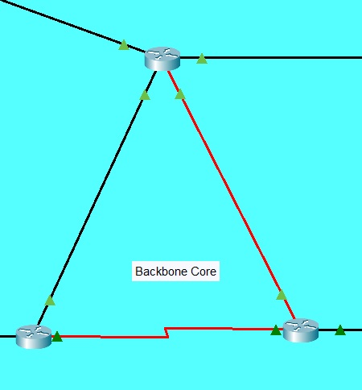
</div>

### Sede Central

<div align="center">
  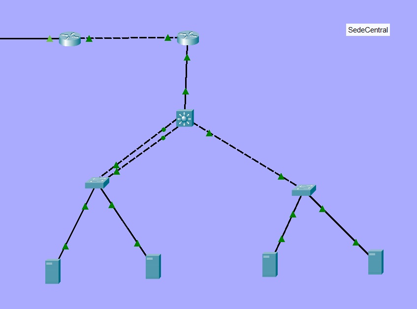
</div>

### Sede Occidental

<div align="center">
  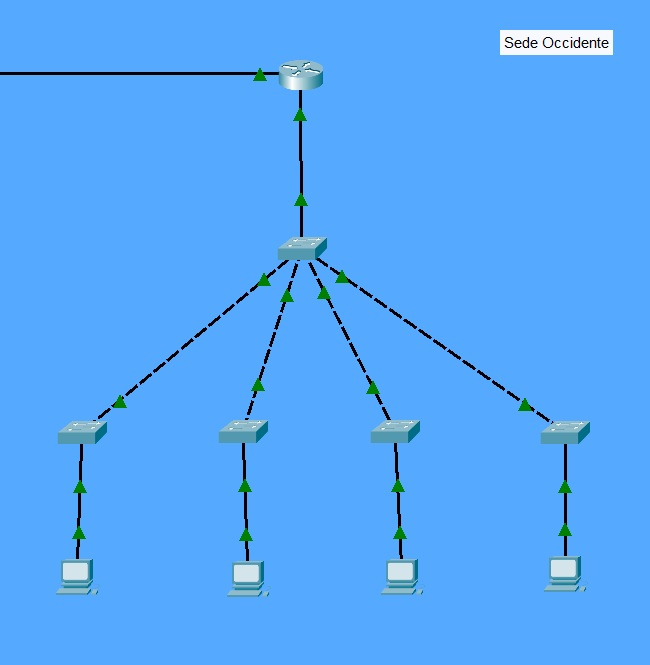
</div>

### Sede Norte

<div align="center">
  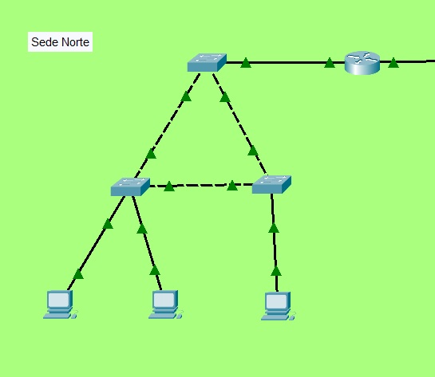
</div>

### Sede Oriental

<div align="center">
  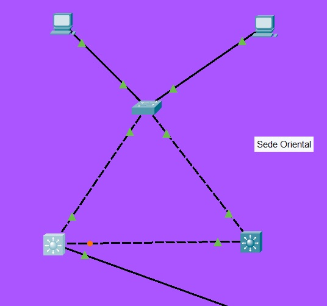
</div>

---

## Topología etiquetando los tipos de interfaces y medios de transmisión

<div align="center">
  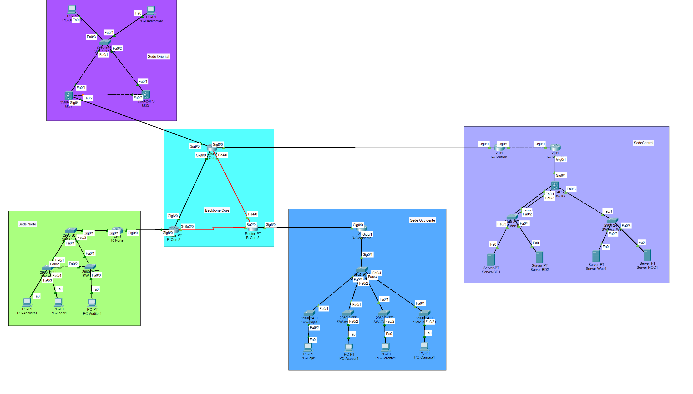
</div>

### Backbone Core

<div align="center">
  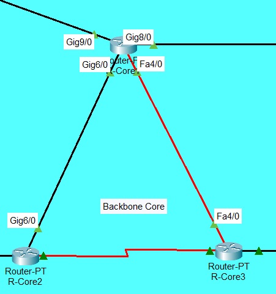
</div>

### Sede Central

<div align="center">
  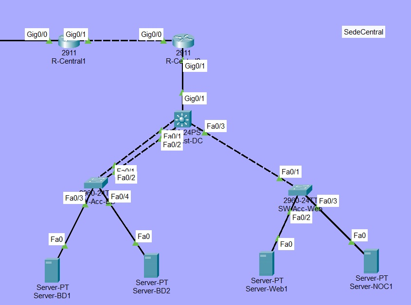
</div>

### Sede Occidental

<div align="center">
  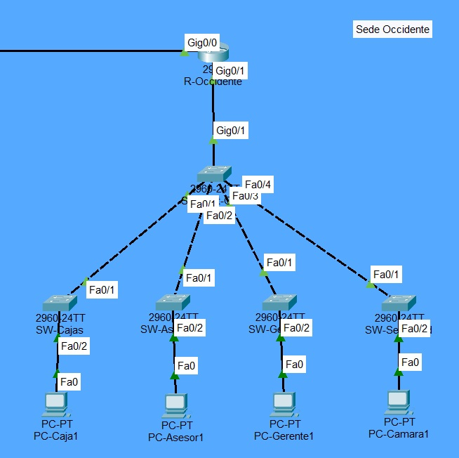
</div>

### Sede Norte

<div align="center">
  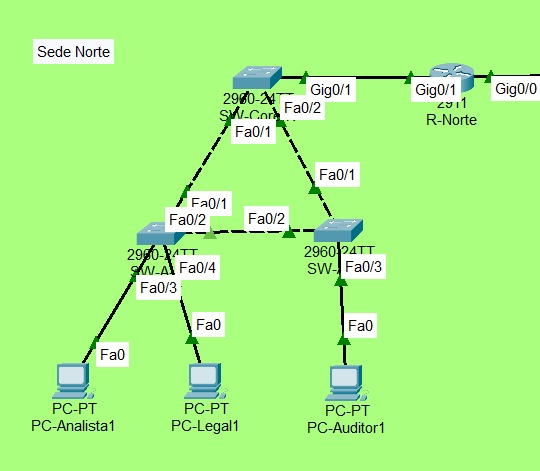
</div>

### Sede Oriental

<div align="center">
  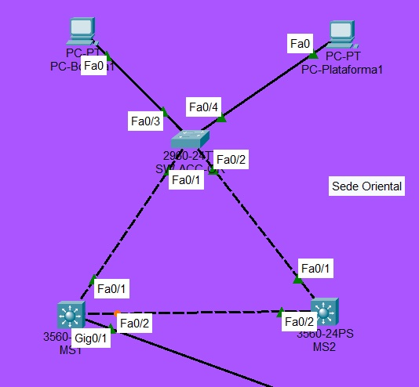
</div>


---

## 2. Tablas de Subnetting — VLSM y FLSM

> **Nota:** Se utilizó el bloque `172.16.0.0/16` como espacio de direcciones para las redes de borde,
> asignando subredes /24 por sede según el valor XX=70 del carnet
> (172.16.70.x para Occidente, 172.16.71.x para Norte, 172.16.72.x para Oriente
> y 172.16.73.x para el Data Center). Para los enlaces punto a punto del backbone
> se utilizó el bloque `10.70.0.0/24` con subnetting FLSM /30.

---

### 📌 BACKBONE CORE — Enlaces Punto a Punto (FLSM /30)

| Enlace | Red | Máscara | IP1 | IP2 | Broadcast |
|--------|-----|---------|-----|-----|-----------|
| R-Core1 ↔ R-Core2 | 10.70.0.0/30 | 255.255.255.252 | 10.70.0.1 | 10.70.0.2 | 10.70.0.3 |
| R-Core1 ↔ R-Core3 | 10.70.0.4/30 | 255.255.255.252 | 10.70.0.5 | 10.70.0.6 | 10.70.0.7 |
| R-Core2 ↔ R-Core3 | 10.70.0.8/30 | 255.255.255.252 | 10.70.0.9 | 10.70.0.10 | 10.70.0.11 |
| R-Core1 ↔ R-Central1 | 10.70.0.12/30 | 255.255.255.252 | 10.70.0.13 | 10.70.0.14 | 10.70.0.15 |
| R-Core2 ↔ R-Norte | 10.70.0.16/30 | 255.255.255.252 | 10.70.0.17 | 10.70.0.18 | 10.70.0.19 |
| R-Core3 ↔ R-Occidente | 10.70.0.20/30 | 255.255.255.252 | 10.70.0.21 | 10.70.0.22 | 10.70.0.23 |
| R-Central1 ↔ R-Central2 | 10.70.0.24/30 | 255.255.255.252 | 10.70.0.25 | 10.70.0.26 | 10.70.0.27 |
| R-Core1 ↔ MS1 | 10.70.0.28/30 | 255.255.255.252 | 10.70.0.29 | 10.70.0.30 | 10.70.0.31 |
| R-Central2 ↔ SW-Dist-DC | 10.70.0.56/30 | 255.255.255.252 | 10.70.0.57 | 10.70.0.58 | 10.70.0.59 |

> **Nota:** El bloque `10.70.0.32/30` al `10.70.0.55/30` queda reservado para expansión futura.

---

### 📌 SEDE OCCIDENTE — VLSM

**VLANs:** Y=0 → IDs: 10, 20, 30, 40
**Bloque base:** `172.16.70.0/24`

| VLAN | Nombre | ID | Hosts Req. | Hosts Útiles | Red | Máscara | Gateway | Rango Usable | Broadcast |
|------|--------|----|-----------|--------------|-----|---------|---------|--------------|-----------|
| 1Y | Cajas | 10 | 45 | 62 | 172.16.70.0/26 | 255.255.255.192 | 172.16.70.1 | 172.16.70.2 – 172.16.70.62 | 172.16.70.63 |
| 2Y | Asesores | 20 | 30 | 30 | 172.16.70.64/27 | 255.255.255.224 | 172.16.70.65 | 172.16.70.66 – 172.16.70.94 | 172.16.70.95 |
| 4Y | Seguridad | 40 | 12 | 14 | 172.16.70.96/28 | 255.255.255.240 | 172.16.70.97 | 172.16.70.98 – 172.16.70.110 | 172.16.70.111 |
| 3Y | Gerencia | 30 | 10 | 14 | 172.16.70.112/28 | 255.255.255.240 | 172.16.70.113 | 172.16.70.114 – 172.16.70.126 | 172.16.70.127 |

> **VTP:** Dominio: `bantech70` | Password: `cisco`

---

### 📌 SEDE NORTE — VLSM

**VLANs:** Y=0 → IDs: 50, 60, 70
**Bloque base:** `172.16.71.0/24`

| VLAN | Nombre | ID | Hosts Req. | Hosts Útiles | Red | Máscara | Gateway | Rango Usable | Broadcast |
|------|--------|----|-----------|--------------|-----|---------|---------|--------------|-----------|
| 5Y | Análisis | 50 | 50 | 62 | 172.16.71.0/26 | 255.255.255.192 | 172.16.71.1 | 172.16.71.2 – 172.16.71.62 | 172.16.71.63 |
| 6Y | Auditoría | 60 | 25 | 30 | 172.16.71.64/27 | 255.255.255.224 | 172.16.71.65 | 172.16.71.66 – 172.16.71.94 | 172.16.71.95 |
| 7Y | Legal | 70 | 14 | 14 | 172.16.71.96/28 | 255.255.255.240 | 172.16.71.97 | 172.16.71.98 – 172.16.71.110 | 172.16.71.111 |

> **Root Bridge:** SW-Core-N (priority 4096) | **STP:** Rapid PVST+

---

### 📌 SEDE ORIENTE — VLSM

**VLANs:** Y=0 → IDs: 80, 90
**Bloque base:** `172.16.72.0/24`

| VLAN | Nombre | ID | Hosts Req. | Hosts Útiles | Red | Máscara | Gateway Virtual (HSRP) | MS1 IP | MS2 IP | Broadcast |
|------|--------|----|-----------|--------------|-----|---------|----------------------|--------|--------|-----------|
| 8Y | Bóveda | 80 | 40 | 62 | 172.16.72.0/26 | 255.255.255.192 | 172.16.72.1 | 172.16.72.2 | 172.16.72.3 | 172.16.72.63 |
| 9Y | Plataforma | 90 | 60 | 62 | 172.16.72.64/26 | 255.255.255.192 | 172.16.72.65 | 172.16.72.66 | 172.16.72.67 | 172.16.72.127 |

> **HSRP:** MS1 = Active (priority 110, preempt) | MS2 = Standby (priority 100)

---

### 📌 DATA CENTER Y SEDE CENTRAL — VLSM

**VLANs:** Y=0 → IDs: 10, 20, 30
**Bloque base:** `172.16.73.0/24`

| VLAN | Nombre | ID | Hosts Req. | Hosts Útiles | Red | Máscara | Gateway (SVI SW-Dist-DC) | Rango Usable | Broadcast |
|------|--------|----|-----------|--------------|-----|---------|--------------------------|--------------|-----------|
| 2Y | Web_Apps | 20 | 28 | 30 | 172.16.73.0/27 | 255.255.255.224 | 172.16.73.1 | 172.16.73.2 – 172.16.73.30 | 172.16.73.31 |
| 1Y | Core_BD | 10 | 14 | 14 | 172.16.73.32/28 | 255.255.255.240 | 172.16.73.33 | 172.16.73.34 – 172.16.73.46 | 172.16.73.47 |
| 3Y | NOC | 30 | 10 | 14 | 172.16.73.48/28 | 255.255.255.240 | 172.16.73.49 | 172.16.73.50 – 172.16.73.62 | 172.16.73.63 |

> **EtherChannel:** LACP (Port-channel1) entre SW-Dist-DC y SW-Acc-BD

---

### 📋 Tabla de IPs asignadas — corregida

**Servidores — Data Center**

| Dispositivo | IP | Máscara | Gateway |
|------------|-----|---------|---------|
| Server-BD1 | 172.16.73.34 | 255.255.255.240 | 172.16.73.33 |
| Server-BD2 | 172.16.73.35 | 255.255.255.240 | 172.16.73.33 |
| Server-Web1 | 172.16.73.3 | 255.255.255.224 | 172.16.73.1 |
| Server-NOC1 | 172.16.73.50 | 255.255.255.240 | 172.16.73.49 |

**PCs — Sede Occidente**

| PC | IP | Máscara | Gateway |
|----|-----|---------|---------|
| PC-Caja1 | 172.16.70.2 | 255.255.255.192 | 172.16.70.1 |
| PC-Asesor1 | 172.16.70.66 | 255.255.255.224 | 172.16.70.65 |
| PC-Gerente1 | 172.16.70.114 | 255.255.255.240 | 172.16.70.113 |
| PC-Camara1 | 172.16.70.98 | 255.255.255.240 | 172.16.70.97 |

**PCs — Sede Norte**

| PC | IP | Máscara | Gateway |
|----|-----|---------|---------|
| PC-Analista1 | 172.16.71.2 | 255.255.255.192 | 172.16.71.1 |
| PC-Auditor1 | 172.16.71.66 | 255.255.255.224 | 172.16.71.65 |
| PC-Legal1 | 172.16.71.98 | 255.255.255.240 | 172.16.71.97 |

**PCs — Sede Oriente**

| PC | IP | Máscara | Gateway (HSRP Virtual) |
|----|-----|---------|----------------------|
| PC-Boveda1 | 172.16.72.4 | 255.255.255.192 | 172.16.72.1 |
| PC-Plataforma1 | 172.16.72.68 | 255.255.255.192 | 172.16.72.65 |

---

## 3. Justificaciones Técnicas de Diseño por Sede

---

### 🟠 Sede Occidente — Justificación

La Sede Occidente implementa una **topología en estrella jerárquica** con un switch de distribución central (SW-Dist-OCC) al cual se conectan switches de acceso dedicados por área funcional. Esta decisión arquitectónica responde directamente a la necesidad operativa de la agencia: aislar completamente el tráfico transaccional de las cajas del tráfico generado por los asesores de servicio al cliente. Al segmentar cada área en su propia VLAN (Cajas-VLAN10, Asesores-VLAN20, Gerencia-VLAN30, Seguridad-VLAN40), un incidente en el segmento de asesores — como una tormenta de broadcast o un equipo mal configurado — no puede propagarse al segmento de transacciones críticas.

La técnica de **Router-on-a-Stick** en R-Occidente se justifica por su eficiencia en entornos donde el router de borde ya existe como punto de conexión al backbone: en lugar de agregar un switch multicapa adicional, se aprovechan las subinterfaces del router para el enrutamiento inter-VLAN, reduciendo costos de hardware sin sacrificar la segmentación. El enlace troncal 802.1Q entre SW-Dist-OCC y R-Occidente transporta todas las VLANs en un único enlace físico, simplificando el cableado. La administración centralizada de VLANs mediante **VTP** (dominio `bantech70`) garantiza consistencia en la configuración de todos los switches de acceso, reduciendo el error humano en una agencia con alto volumen operativo.

**Tolerancia a fallos:** Si un switch de acceso falla, únicamente el área funcional correspondiente pierde conectividad, mientras que las demás áreas continúan operando sin interrupción. El switch de distribución central constituye el único punto de falla potencial, por lo que se recomienda documentar un procedimiento de reemplazo rápido para este equipo.

---

### 🟢 Sede Norte — Justificación

La Sede Norte implementa una **topología de anillo/triángulo de switches** (SW-Core-N conectado en bucle con SW-A-N1 y SW-A-N2), generando intencionalmente rutas físicas redundantes entre todos los nodos de la red. Esta decisión responde directamente al contexto operativo crítico de la sede: si la red se interrumpe, la aprobación de créditos a nivel nacional queda paralizada. Al existir al menos dos caminos físicos entre cualquier par de switches, la caída de un enlace o un switch de acceso no genera una pérdida total de conectividad.

La implementación de **Rapid PVST+ (802.1w)** es obligatoria en este diseño porque los bucles físicos intencionales generarían tormentas de broadcast devastadoras si no existiera un protocolo que gestione el árbol de expansión. Rapid PVST+ se elige sobre el STP clásico (802.1D) por su tiempo de convergencia significativamente menor (aproximadamente 1-2 segundos frente a los 30-50 segundos del STP tradicional), lo cual es crítico en un entorno financiero donde cada segundo de inactividad representa pérdidas económicas.

El **Root Bridge es forzado en SW-Core-N** mediante la configuración explícita de `spanning-tree vlan X priority 4096`. Esta decisión se justifica porque SW-Core-N es el switch de mayor capacidad y el punto de conexión hacia R-Norte; forzar el Root Bridge en este equipo garantiza que el árbol de expansión converja de forma óptima, con los puertos de menor rendimiento bloqueados en los switches de acceso y no en el switch principal. Si el Root Bridge se eligiera automáticamente (por MAC address), podría recaer en un switch de acceso, generando rutas de tráfico subóptimas.

**Tolerancia a fallos:** Ante la caída del enlace entre SW-A-N1 y SW-Core-N, Rapid PVST+ activa en menos de 2 segundos el puerto previamente bloqueado, reestableciendo la conectividad sin intervención manual.

---

### 🔴 Sede Oriente — Justificación

La Sede Oriente implementa una **topología de acceso dual** donde el switch de acceso (SW-ACC-OR) se conecta simultáneamente a dos switches multicapa (MS1 y MS2) previamente integrados en el backbone. Esta arquitectura responde al requerimiento crítico de alta disponibilidad del gateway: los usuarios finales de la sede — que operan con valores financieros sensibles — no pueden tolerar la pérdida de conectividad ante la caída del switch principal.

La implementación de **HSRP (Hot Standby Router Protocol)** sobre MS1 y MS2 crea una dirección IP virtual de gateway que es transparente para los hosts finales. Las PCs de la sede configuran como gateway predeterminado la IP virtual (ej. 172.16.72.1 para VLAN Bóveda), sin conocimiento de cuál de los dos switches multicapa está activo en cada momento. MS1 opera como **Active** con priority 110 y MS2 como **Standby** con priority 100. Cuando MS1 pierde conectividad, HSRP detecta el fallo mediante los mensajes Hello (cada 3 segundos, con hold time de 10 segundos) y MS2 asume el rol de Active automáticamente, sin que las PCs necesiten renovar su configuración de red.

**Tolerancia a fallos demostrable:** Al ejecutar `shutdown` en la interfaz activa de MS1, el tráfico migra automáticamente a través de MS2 en un tiempo máximo de 10 segundos (hold time HSRP), verificable mediante pings continuos (`ping -t`) desde las PCs hacia el backbone durante la prueba de failover.

---

### ⚫ Data Center y Sede Central — Justificación

El Data Center implementa una **topología jerárquica de tres capas** (R-Central2 como capa de núcleo/borde, SW-Dist-DC como capa de distribución, y switches de acceso dedicados por granja de servidores). Esta arquitectura es la más adecuada para un entorno de alta densidad de tráfico porque separa claramente las funciones de enrutamiento, agregación y acceso, facilitando la escalabilidad y el aislamiento de fallos.

La implementación de **EtherChannel con LACP (IEEE 802.3ad)** entre SW-Dist-DC y SW-Acc-BD agrupa mínimo 2 puertos físicos en un único canal lógico (Port-channel1), duplicando el ancho de banda disponible (ej. de 1 Gbps a 2 Gbps) hacia los servidores de base de datos. Esta decisión responde directamente a la necesidad operativa: las granjas de servidores manejan ráfagas masivas de tráfico transaccional que saturan un enlace individual. LACP se elige sobre PAgP por ser un estándar abierto IEEE, garantizando compatibilidad futura con equipos de otros fabricantes. Adicionalmente, EtherChannel proporciona tolerancia a fallos a nivel de enlace físico: si uno de los cables falla, el tráfico continúa por los cables restantes sin interrupción del servicio.

El aislamiento en el **segmento de rutas estáticas** responde a las políticas de seguridad de la información: al no participar en protocolos de enrutamiento dinámico, los servidores centrales no son alcanzables desde rutas no autorizadas del backbone. R-Central1 actúa como el único punto de redistribución controlada, propagando las rutas estáticas del Data Center hacia el dominio OSPF del backbone mediante `redistribute static subnets`, permitiendo conectividad desde todas las sedes sin exponer los servidores a anuncios de enrutamiento no controlados.

---

### 🔵 Backbone Core Nacional — Justificación de Arquitectura

El backbone core de BanTech GT fue diseñado bajo el principio de **redundancia sin punto único de falla**, respondiendo al contexto crítico de una entidad financiera donde la caída del núcleo implicaría la interrupción de transacciones a nivel nacional.

#### Topología del Núcleo

El núcleo está conformado por tres routers de Capa 3 (R-Core1, R-Core2, R-Core3) interconectados en **topología de triángulo**, garantizando que la caída de cualquier enlace o dispositivo individual mantenga al menos un camino alternativo entre todas las sedes. Esta decisión responde directamente al requerimiento de tolerancia a fallos en el núcleo principal.

Los tres medios físicos requeridos se implementaron de la siguiente forma:
- **Fibra óptica** (R-Core1 ↔ R-Core3, FastEthernet): representa el enlace de alta velocidad del núcleo central.
- **Ethernet** (R-Core1 ↔ R-Core2, GigabitEthernet): enlace de alta capacidad para tráfico transaccional.
- **Serial WAN** (R-Core2 ↔ R-Core3, Serial DCE): simula conectividad WAN remota entre nodos del backbone, con R-Core2 proveyendo el `clock rate`.

#### Dominios de Enrutamiento

El backbone integra tres dominios diferenciados, cada uno justificado por su rol operativo:

- **OSPF (área 0)** es el protocolo principal del núcleo. Se eligió por su convergencia rápida, soporte de VLSM y escalabilidad. Todos los routers del backbone (R-Core1, R-Core2, R-Core3) y los routers de borde (R-Central1, R-Occidente, MS1) participan en OSPF área 0, garantizando que cualquier cambio de topología sea propagado eficientemente a toda la red.

- **EIGRP** opera en el dominio de la Sede Norte (R-Norte ↔ R-Core2). Se eligió EIGRP para esta sede por su naturaleza de protocolo de expansión regional con convergencia rápida mediante DUAL, y porque representa un dominio administrativo independiente que se integra al backbone mediante redistribución en R-Core2.

- **RIPv2** fue el protocolo original del dominio de Sede Occidente. Aunque fue reemplazado por OSPF durante el proceso de convergencia del backbone, su presencia inicial en R-Core3 representó el requerimiento de integración de una "red legada". La redistribución entre RIP y OSPF en R-Core3 demostró la capacidad del backbone de absorber dominios con protocolos distintos.

- **Rutas estáticas** aíslan el segmento del Data Center (R-Central1 → R-Central2 → SW-Dist-DC) por políticas estrictas de seguridad de la información. R-Central1 redistribuye estas rutas estáticas hacia OSPF mediante `redistribute static subnets`, integrando el DC al backbone sin exponerlo a actualizaciones dinámicas de enrutamiento.

#### Puntos de Redistribución

El diseño incluye dos puntos de redistribución explícitos:

1. **R-Core2** redistribuye entre OSPF y EIGRP, permitiendo que las rutas de Sede Norte sean conocidas por todo el backbone y viceversa.
2. **R-Central1** redistribuye rutas estáticas hacia OSPF, integrando el segmento de alta seguridad del Data Center al dominio principal.
3. **R-Core3** actuó como punto de redistribución entre OSPF y RIP durante la fase de integración de Sede Occidente.

#### EtherChannel

El requerimiento de agregación de enlaces del backbone se implementó en la **capa de distribución del Data Center** (SW-Dist-DC ↔ SW-Acc-BD) mediante **EtherChannel LACP** con dos enlaces físicos FastEthernet. Esta decisión responde a una limitación técnica de Cisco Packet Tracer: los routers Router-PT no soportan el comando `channel-group`, por lo que EtherChannel entre routers no es simulable en esta plataforma. La implementación en la capa de acceso a servidores es técnicamente más relevante, ya que es precisamente en los enlaces hacia las granjas de servidores donde las ráfagas masivas de tráfico justifican la agregación de ancho de banda.

#### Subnetting del Backbone

Los enlaces punto a punto del backbone utilizan subredes **/30** (FLSM) del bloque `10.70.0.0/24`, optimizando el espacio de direcciones al asignar exactamente 2 hosts utilizables por enlace. Las redes de usuario en cada sede utilizan VLSM sobre el bloque `172.16.0.0/16`, dimensionando cada subred según los hosts requeridos por área funcional.

---

## Tabla de conexiones de la Topología Física

---

### 🌐 Backbone Core

| # | Dispositivo A | Puerto A | Dispositivo B | Puerto B | Tipo de Cable | Medio Físico | Propósito |
|---|---------------|----------|---------------|----------|---------------|--------------|-----------|
| 1 | R-Core1 (Router-PT) | Fa4/0 | R-Core3 (Router-PT) | Fa4/0 | Fibra Óptica | Fibra | Enlace núcleo — medio óptico requerido |
| 2 | R-Core1 (Router-PT) | Gig6/0 | R-Core2 (Router-PT) | Gig6/0 | Copper Straight-Through | Ethernet | EtherChannel Enlace Ethernet dedicado núcleo — alta capacidad |
| 3 | R-Core2 (Router-PT) | Se2/0 (DCE 🕐) | R-Core3 (Router-PT) | Se2/0 | Serial DCE | Serial WAN | Enlace WAN — medio serial requerido |
| 4 | R-Core1 (Router-PT) | Gig8/0 | R-Central1 (Router 2911) | Gig0/0 | Copper Straight-Through | Ethernet | Enlace núcleo → borde Data Center |
| 5 | R-Core2 (Router-PT) | Gig8/0 | R-Norte (Router 2911) | Gig0/0 | Copper Straight-Through | Ethernet | Enlace núcleo → borde Sede Norte |
| 6 | R-Core3 (Router-PT) | Gig6/0 | R-Occidente (Router 2911) | Gig0/0 | Copper Straight-Through | Ethernet | Enlace núcleo → borde Sede Occidente |
| 7 | R-Central1 (Router 2911) | Gig0/1 | R-Central2 (Router 2911) | Gig0/0 | Copper Straight-Through | Ethernet | Enlace borde → Data Center (segmento estático) |
| 8 | R-Core1 (Router-PT) | Gig9/0 | MS1 (Switch 3560-24PS) | Gig0/1 | Copper Straight-Through | Ethernet | Enlace núcleo → Sede Oriente (HSRP Active) |

> **Nota sobre el EtherChannel:** Nota sobre el enlace R-Core1 ↔ R-Core2: Se utiliza un único enlace GigabitEthernet dedicado. El mecanismo de agregación de enlaces (EtherChannel LACP) del backbone se implementa en la capa de distribución del Data Center (SW-Dist-DC ↔ SW-Acc-BD), cumpliendo el requerimiento del enunciado. El Router-PT de Cisco Packet Tracer no implementa el comando channel-group, por lo que EtherChannel no es simulable entre routers en esta plataforma.
>
> **Nota sobre el Serial DCE:** El símbolo del reloj (🕐) queda del lado de R-Core2, quien provee el `clock rate` al enlace WAN.
>
> **Nota sobre MS1 y MS2:** Según el enunciado, MS1 y MS2 son parte del backbone. MS1 recibe el enlace del núcleo (enlace 9). MS2 se interconecta con MS1 directamente (ver Sede Oriente).

---

### 🏦 Sede Occidente (Agencia Regional Comercial)

| # | Dispositivo A | Puerto A | Dispositivo B | Puerto B | Tipo de Cable | Propósito |
|---|---------------|----------|---------------|----------|---------------|-----------|
| 1 | R-Occidente (Router 2911) | Gig0/1 | SW-Dist-OCC (Switch 2960-24TT) | Gig0/1 | Copper Straight-Through | Trunk 802.1Q — Router-on-a-Stick |
| 2 | SW-Dist-OCC (Switch 2960-24TT) | Fa0/1 | SW-Cajas (Switch 2960-24TT) | Fa0/1 | Copper Cross-Over | Trunk hacia switch de acceso VLAN 10 |
| 3 | SW-Dist-OCC (Switch 2960-24TT) | Fa0/2 | SW-Asesores (Switch 2960-24TT) | Fa0/1 | Copper Cross-Over | Trunk hacia switch de acceso VLAN 20 |
| 4 | SW-Dist-OCC (Switch 2960-24TT) | Fa0/3 | SW-Gerencia (Switch 2960-24TT) | Fa0/1 | Copper Cross-Over | Trunk hacia switch de acceso VLAN 30 |
| 5 | SW-Dist-OCC (Switch 2960-24TT) | Fa0/4 | SW-Seguridad (Switch 2960-24TT) | Fa0/1 | Copper Cross-Over | Trunk hacia switch de acceso VLAN 40 |
| 6 | SW-Cajas (Switch 2960-24TT) | Fa0/2 | PC-Caja1 (PC) | Fa0 | Copper Straight-Through | Host de prueba — VLAN 10 Cajas |
| 7 | SW-Asesores (Switch 2960-24TT) | Fa0/2 | PC-Asesor1 (PC) | Fa0 | Copper Straight-Through | Host de prueba — VLAN 20 Asesores |
| 8 | SW-Gerencia (Switch 2960-24TT) | Fa0/2 | PC-Gerente1 (PC) | Fa0 | Copper Straight-Through | Host de prueba — VLAN 30 Gerencia |
| 9 | SW-Seguridad (Switch 2960-24TT) | Fa0/2 | PC-Camara1 (PC) | Fa0 | Copper Straight-Through | Host de prueba — VLAN 40 Seguridad |

> **Switch principal:** SW-Dist-OCC actúa como Switch de Distribución y VTP Server.
>
> **Puertos Trunk:** Fa0/1–Fa0/4 de SW-Dist-OCC y Gig0/1 de SW-Dist-OCC → R-Occidente.
>
> **Puertos de Acceso:** Fa0/2 de cada switch de acceso hacia sus respectivas PCs.

---

### 📊 Sede Norte (Centro de Autorización de Créditos)

| # | Dispositivo A | Puerto A | Dispositivo B | Puerto B | Tipo de Cable | Propósito |
|---|---------------|----------|---------------|----------|---------------|-----------|
| 1 | R-Norte (Router 2911) | Gig0/1 | SW-Core-N (Switch 2960-24TT) | Gig0/1 | Copper Straight-Through | Uplink backbone → sede (Root Bridge) |
| 2 | SW-Core-N (Switch 2960-24TT) | Fa0/1 | SW-A-N1 (Switch 2960-24TT) | Fa0/1 | Copper Cross-Over | Lado izquierdo del triángulo STP |
| 3 | SW-Core-N (Switch 2960-24TT) | Fa0/2 | SW-A-N2 (Switch 2960-24TT) | Fa0/1 | Copper Cross-Over | Lado derecho del triángulo STP |
| 4 | SW-A-N1 (Switch 2960-24TT) | Fa0/2 | SW-A-N2 (Switch 2960-24TT) | Fa0/2 | Copper Cross-Over | Base del triángulo — bucle físico intencional |
| 5 | SW-A-N1 (Switch 2960-24TT) | Fa0/3 | PC-Analista1 (PC) | Fa0 | Copper Straight-Through | Host de prueba — VLAN 50 Análisis |
| 6 | SW-A-N1 (Switch 2960-24TT) | Fa0/4 | PC-Legal1 (PC) | Fa0 | Copper Straight-Through | Host de prueba — VLAN 70 Legal |
| 7 | SW-A-N2 (Switch 2960-24TT) | Fa0/3 | PC-Auditor1 (PC) | Fa0 | Copper Straight-Through | Host de prueba — VLAN 60 Auditoría |

> **Root Bridge:** SW-Core-N (se forzará con `spanning-tree vlan X priority 4096` en la fase de configuración).
>
> **Bucle intencional:** El enlace 4 (SW-A-N1 Fa0/2 ↔ SW-A-N2 Fa0/2) crea el bucle que Rapid PVST+ gestionará. Es normal que un puerto aparezca en ámbar al conectarlo.
>
> **Protocolo STP:** Rapid PVST+ obligatorio en los 3 switches.

---

### 🏛️ Sede Oriente (Centro Financiero Legado)

| # | Dispositivo A | Puerto A | Dispositivo B | Puerto B | Tipo de Cable | Propósito |
|---|---------------|----------|---------------|----------|---------------|-----------|
| 1 | MS1 (Switch 3560-24PS) | Fa0/1 | SW-ACC-OR (Switch 2960-24TT) | Fa0/1 | Copper Cross-Over | Uplink principal — HSRP Active |
| 2 | MS2 (Switch 3560-24PS) | Fa0/1 | SW-ACC-OR (Switch 2960-24TT) | Fa0/2 | Copper Cross-Over | Uplink redundante — HSRP Standby |
| 3 | MS1 (Switch 3560-24PS) | Fa0/2 | MS2 (Switch 3560-24PS) | Fa0/2 | Copper Cross-Over | Enlace de sincronización entre multicapas |
| 4 | SW-ACC-OR (Switch 2960-24TT) | Fa0/3 | PC-Boveda1 (PC) | Fa0 | Copper Straight-Through | Host de prueba — VLAN 80 Bóveda ⚠️ PENDIENTE |
| 5 | SW-ACC-OR (Switch 2960-24TT) | Fa0/4 | PC-Plataforma1 (PC) | Fa0 | Copper Straight-Through | Host de prueba — VLAN 90 Plataforma ⚠️ PENDIENTE |

> **Enlace al backbone:** MS1 ya recibe el enlace desde R-Core1 Gig9/0 (definido en la tabla del Backbone, enlace #9).
>
> **HSRP:** MS1 = Active (priority 110), MS2 = Standby (priority 100). Los hosts usarán la IP virtual como gateway.

---

### 🖥️ Data Center y Sede Central (Alta Seguridad)

| # | Dispositivo A | Puerto A | Dispositivo B | Puerto B | Tipo de Cable | Propósito |
|---|---------------|----------|---------------|----------|---------------|-----------|
| 1 | R-Central2 (Router 2911) | Gig0/1 | SW-Dist-DC (Switch 3560-24PS) | Gig0/1 | Copper Straight-Through | Enlace router borde → switch distribución DC |
| 2 | SW-Dist-DC (Switch 3560-24PS) | Fa0/1 | SW-Acc-BD (Switch 2960-24TT) | Fa0/1 | Copper Cross-Over | EtherChannel LACP — cable 1 de 2 |
| 3 | SW-Dist-DC (Switch 3560-24PS) | Fa0/2 | SW-Acc-BD (Switch 2960-24TT) | Fa0/2 | Copper Cross-Over | EtherChannel LACP — cable 2 de 2 |
| 4 | SW-Dist-DC (Switch 3560-24PS) | Fa0/3 | SW-Acc-Web (Switch 2960-24TT) | Fa0/1 | Copper Cross-Over | Enlace estándar hacia switch Web/NOC |
| 5 | SW-Acc-BD (Switch 2960-24TT) | Fa0/3 | Server-BD1 (Server-PT) | Fa0 | Copper Straight-Through | Servidor BD1 — VLAN 10 Core_BD |
| 6 | SW-Acc-BD (Switch 2960-24TT) | Fa0/4 | Server-BD2 (Server-PT) | Fa0 | Copper Straight-Through | Servidor BD2 — VLAN 10 Core_BD |
| 7 | SW-Acc-Web (Switch 2960-24TT) | Fa0/2 | Server-Web1 (Server-PT) | Fa0 | Copper Straight-Through | Servidor Web — VLAN 20 Web_Apps |
| 8 | SW-Acc-Web (Switch 2960-24TT) | Fa0/3 | Server-NOC1 (Server-PT) | Fa0 | Copper Straight-Through | Servidor NOC — VLAN 30 NOC |

> **EtherChannel:** Los enlaces 2 y 3 forman el Port-Channel1 entre SW-Dist-DC y SW-Acc-BD. Se configurarán con LACP (`channel-group 1 mode active`) en la fase de configuración.
>
> **Enrutamiento:** Este segmento usa rutas estáticas. R-Central1 redistribuirá estas rutas hacia OSPF del backbone mediante `redistribute static subnets`.
>
> **Switch de distribución:** SW-Dist-DC (3560-24PS) actúa como capa de distribución con capacidades Layer 3.

---

Hay tres correcciones que hacer:

**Tabla de dispositivos:**
- R-Core3 debe decir "Core OSPF + Punto de redistribución" porque sí redistribuye (connected subnets hacia OSPF).
- R-Occidente debe decir "Borde OSPF + Router-on-a-Stick" — ya no usa RIPv2, lo eliminamos durante la configuración y quedó con OSPF + ruta default estática.

**Tabla de protocolos:**
- La fila de RIPv2 debe eliminarse o corregirse. RIPv2 fue removido tanto de R-Core3 como de R-Occidente. Ya no existe RIPv2 en la red.
- La fila "Redistribución OSPF↔RIPv2 | R-Core3" también debe eliminarse por la misma razón.
- Falta agregar la fila de Router-on-a-Stick para R-Norte, que también usa subinterfaces (VLANs 50, 60, 70).
- Falta agregar MS1 y R-Central1 en OSPF.

Aquí están las tablas corregidas:

```markdown
### 📋 Resumen de Dispositivos

| Dispositivo | Modelo | Rol | Sede |
|-------------|--------|-----|------|
| R-Core1 | Router-PT | Core OSPF | Backbone |
| R-Core2 | Router-PT | Core OSPF + Redistribución OSPF↔EIGRP | Backbone |
| R-Core3 | Router-PT | Core OSPF + Redistribución connected→OSPF | Backbone |
| R-Central1 | Router 2911 | Borde DC + Redistribución Estáticas→OSPF | Backbone/DC |
| R-Central2 | Router 2911 | Router de borde Data Center | Data Center |
| R-Norte | Router 2911 | Borde EIGRP + Router-on-a-Stick | Sede Norte |
| R-Occidente | Router 2911 | Borde OSPF + Router-on-a-Stick | Sede Occidente |
| MS1 | Switch 3560-24PS | HSRP Active + OSPF — parte del backbone | Sede Oriente |
| MS2 | Switch 3560-24PS | HSRP Standby — parte del backbone | Sede Oriente |
| SW-Dist-OCC | Switch 2960-24TT | Switch Principal / VTP Server | Sede Occidente |
| SW-Cajas | Switch 2960-24TT | Switch de Acceso VLAN 10 | Sede Occidente |
| SW-Asesores | Switch 2960-24TT | Switch de Acceso VLAN 20 | Sede Occidente |
| SW-Gerencia | Switch 2960-24TT | Switch de Acceso VLAN 30 | Sede Occidente |
| SW-Seguridad | Switch 2960-24TT | Switch de Acceso VLAN 40 | Sede Occidente |
| SW-Core-N | Switch 2960-24TT | Root Bridge (priority 4096) + VTP Server | Sede Norte |
| SW-A-N1 | Switch 2960-24TT | Switch de Acceso VLANs 50 y 70 + VTP Client | Sede Norte |
| SW-A-N2 | Switch 2960-24TT | Switch de Acceso VLAN 60 + VTP Client | Sede Norte |
| SW-ACC-OR | Switch 2960-24TT | Switch de Acceso (dual uplink a MS1/MS2) | Sede Oriente |
| SW-Dist-DC | Switch 3560-24PS | Switch Distribución Data Center | Data Center |
| SW-Acc-BD | Switch 2960-24TT | Switch Acceso EtherChannel — Servidores BD | Data Center |
| SW-Acc-Web | Switch 2960-24TT | Switch Acceso — Servidores Web y NOC | Data Center |

---

## 📊 Resumen de Protocolos y Tecnologías

| Tecnología | Dispositivos Involucrados | Sede |
|------------|--------------------------|------|
| OSPF (dominio principal) | R-Core1, R-Core2, R-Core3, R-Central1, R-Central2, R-Occidente, MS1 | Backbone |
| EIGRP (expansión regional) | R-Core2, R-Norte | Backbone / Norte |
| Rutas Estáticas (alta seguridad) | R-Central1, R-Central2, SW-Dist-DC, R-Occidente | Data Center / Occidente |
| Redistribución OSPF↔EIGRP | R-Core2 | Backbone |
| Redistribución Estáticas→OSPF | R-Central1 | Backbone/DC |
| Redistribución Connected→OSPF | R-Core3 | Backbone |
| EtherChannel LACP (Port-Channel1) | SW-Dist-DC ↔ SW-Acc-BD | Data Center |
| HSRP | MS1 (Active, priority 110), MS2 (Standby, priority 100) | Sede Oriente |
| Rapid PVST+ | SW-Core-N, SW-A-N1, SW-A-N2 | Sede Norte |
| Router-on-a-Stick (802.1Q) | R-Occidente + SW-Dist-OCC | Sede Occidente |
| Router-on-a-Stick (802.1Q) | R-Norte + SW-Core-N | Sede Norte |
| VTP (Dominio: bantech70) | SW-Dist-OCC (Server), SW-Cajas/Asesores/Gerencia/Seguridad (Client) | Sede Occidente |
| VTP (Dominio: bantech70) | SW-Core-N (Server), SW-A-N1/SW-A-N2 (Client) | Sede Norte |
```

---


## Extractos de las configuraciones más importantes de los dispositivos.


**⚙️ Comandos de Configuración — Red Nacional BanTech GT**
**Carnet:** 201504070 | **XX = 70** | **Y = 0**
**OSPF Process-ID:** 1 | **EIGRP AS:** 1 | **HSRP Grupo:** 1

---

> **Convención utilizada:**
> - Todos los comandos se ejecutan desde la CLI de Cisco Packet Tracer.
> - Se ingresa al modo privilegiado con `enable`, luego al modo de configuración global con `configure terminal`.
> - El símbolo `!` representa un comentario o separador de sección.
> - Las IPs utilizadas corresponden al plan de subnetting VLSM/FLSM previamente calculado.

---

## 🌐 BACKBONE CORE

### R-Core1 (Router-PT)

```sh
enable
configure terminal

hostname R-Core1

interface FastEthernet4/0
 description FIBRA-hacia-R-Core3
 ip address 10.70.0.5 255.255.255.252
 no shutdown

interface GigabitEthernet6/0
 description ENLACE-hacia-R-Core2
 ip address 10.70.0.1 255.255.255.252
 no shutdown

interface GigabitEthernet8/0
 description ENLACE-hacia-R-Central1
 ip address 10.70.0.13 255.255.255.252
 no shutdown

interface GigabitEthernet9/0
 description ENLACE-hacia-MS1-SedeOriente
 ip address 10.70.0.29 255.255.255.252
 no shutdown

router ospf 1
 router-id 1.1.1.1
 network 10.70.0.4 0.0.0.3 area 0
 network 10.70.0.0 0.0.0.3 area 0
 network 10.70.0.12 0.0.0.3 area 0
 network 10.70.0.28 0.0.0.3 area 0

end
write memory
```

---

### R-Core2 (Router-PT)

```sh
enable
configure terminal

hostname R-Core2

interface GigabitEthernet6/0
 description ENLACE-hacia-R-Core1
 ip address 10.70.0.2 255.255.255.252
 no shutdown

interface Serial2/0
 description SERIAL-WAN-hacia-R-Core3-DCE
 ip address 10.70.0.9 255.255.255.252
 clock rate 64000
 no shutdown

interface GigabitEthernet8/0
 description ENLACE-hacia-R-Norte
 ip address 10.70.0.17 255.255.255.252
 no shutdown

router ospf 1
 router-id 2.2.2.2
 network 10.70.0.0 0.0.0.3 area 0
 network 10.70.0.8 0.0.0.3 area 0
 network 10.70.0.16 0.0.0.3 area 0
 redistribute eigrp 1 subnets

router eigrp 1
 network 10.70.0.16 0.0.0.3
 redistribute ospf 1 metric 10000 100 255 1 1500
 no auto-summary

end
write memory
```

---

### R-Core3 (Router-PT)

```sh
enable
configure terminal

hostname R-Core3

interface FastEthernet4/0
 description FIBRA-hacia-R-Core1
 ip address 10.70.0.6 255.255.255.252
 no shutdown

interface Serial2/0
 description SERIAL-WAN-hacia-R-Core2-DTE
 ip address 10.70.0.10 255.255.255.252
 no shutdown

interface GigabitEthernet6/0
 description ENLACE-hacia-R-Occidente
 ip address 10.70.0.21 255.255.255.252
 no shutdown

router ospf 1
 router-id 3.3.3.3
 network 10.70.0.4 0.0.0.3 area 0
 network 10.70.0.8 0.0.0.3 area 0
 network 10.70.0.20 0.0.0.3 area 0
 redistribute connected subnets

end
write memory
```

---

### R-Central1 (Router 2911)

```sh
enable
configure terminal

hostname R-Central1

interface GigabitEthernet0/0
 description ENLACE-hacia-R-Core1
 ip address 10.70.0.14 255.255.255.252
 no shutdown

interface GigabitEthernet0/1
 description ENLACE-hacia-R-Central2
 ip address 10.70.0.25 255.255.255.252
 no shutdown

ip route 172.16.73.0  255.255.255.224 10.70.0.26
ip route 172.16.73.32 255.255.255.240 10.70.0.26
ip route 172.16.73.48 255.255.255.240 10.70.0.26

router ospf 1
 router-id 4.4.4.4
 network 10.70.0.12 0.0.0.3 area 0
 network 10.70.0.24 0.0.0.3 area 0
 redistribute static subnets

end
write memory
```

---

### R-Central2 (Router 2911)

```sh
enable
configure terminal

hostname R-Central2

interface GigabitEthernet0/0
 description ENLACE-hacia-R-Central1
 ip address 10.70.0.26 255.255.255.252
 no shutdown

interface GigabitEthernet0/1
 description ENLACE-hacia-SW-Dist-DC
 ip address 10.70.0.58 255.255.255.252
 no shutdown

ip route 172.16.73.0  255.255.255.224 10.70.0.57
ip route 172.16.73.32 255.255.255.240 10.70.0.57
ip route 172.16.73.48 255.255.255.240 10.70.0.57
ip route 0.0.0.0 0.0.0.0 10.70.0.25

router ospf 1
 router-id 6.6.6.6
 network 10.70.0.24 0.0.0.3 area 0
 network 10.70.0.56 0.0.0.3 area 0

end
write memory
```

---

### R-Norte (Router 2911)

```sh
enable
configure terminal

hostname R-Norte

interface GigabitEthernet0/0
 description ENLACE-hacia-R-Core2
 ip address 10.70.0.18 255.255.255.252
 no shutdown

interface GigabitEthernet0/1
 description TRUNK-RoaS-hacia-SW-Core-N
 no shutdown

interface GigabitEthernet0/1.50
 description VLAN50-Analisis
 encapsulation dot1Q 50
 ip address 172.16.71.1 255.255.255.192
 no shutdown

interface GigabitEthernet0/1.60
 description VLAN60-Auditoria
 encapsulation dot1Q 60
 ip address 172.16.71.65 255.255.255.224
 no shutdown

interface GigabitEthernet0/1.70
 description VLAN70-Legal
 encapsulation dot1Q 70
 ip address 172.16.71.97 255.255.255.240
 no shutdown

router eigrp 1
 network 10.70.0.16 0.0.0.3
 network 172.16.71.0  0.0.0.63
 network 172.16.71.64 0.0.0.31
 network 172.16.71.96 0.0.0.15
 no auto-summary

end
write memory
```

---

### R-Occidente (Router 2911)

```sh
enable
configure terminal

hostname R-Occidente

interface GigabitEthernet0/0
 description ENLACE-hacia-R-Core3
 ip address 10.70.0.22 255.255.255.252
 no shutdown

interface GigabitEthernet0/1
 description TRUNK-RoaS-hacia-SW-Dist-OCC
 no shutdown

interface GigabitEthernet0/1.10
 description VLAN10-Cajas
 encapsulation dot1Q 10
 ip address 172.16.70.1 255.255.255.192
 no shutdown

interface GigabitEthernet0/1.20
 description VLAN20-Asesores
 encapsulation dot1Q 20
 ip address 172.16.70.65 255.255.255.224
 no shutdown

interface GigabitEthernet0/1.30
 description VLAN30-Gerencia
 encapsulation dot1Q 30
 ip address 172.16.70.113 255.255.255.240
 no shutdown

interface GigabitEthernet0/1.40
 description VLAN40-Seguridad
 encapsulation dot1Q 40
 ip address 172.16.70.97 255.255.255.240
 no shutdown

router ospf 1
 router-id 6.6.6.6
 network 10.70.0.20 0.0.0.3 area 0
 network 172.16.70.0 0.0.0.63 area 0
 network 172.16.70.64 0.0.0.31 area 0
 network 172.16.70.96 0.0.0.15 area 0
 network 172.16.70.112 0.0.0.15 area 0

! Ruta default hacia backbone — solución a limitación de Packet Tracer
! con propagación OSPF en router 2911
ip route 0.0.0.0 0.0.0.0 10.70.0.21

end
write memory
```

---

## 🏦 SEDE OCCIDENTE

### SW-Dist-OCC (Switch 2960-24TT) — VTP Server

```sh
enable
configure terminal

hostname SW-Dist-OCC

vtp mode server
vtp domain bantech70
vtp password cisco

vlan 10
 name Cajas
vlan 20
 name Asesores
vlan 30
 name Gerencia
vlan 40
 name Seguridad

interface GigabitEthernet0/1
 description TRUNK-hacia-R-Occidente
 switchport mode trunk
 switchport trunk allowed vlan 10,20,30,40
 no shutdown

interface FastEthernet0/1
 description TRUNK-hacia-SW-Cajas
 switchport mode trunk
 switchport trunk allowed vlan 10
 no shutdown

interface FastEthernet0/2
 description TRUNK-hacia-SW-Asesores
 switchport mode trunk
 switchport trunk allowed vlan 20
 no shutdown

interface FastEthernet0/3
 description TRUNK-hacia-SW-Gerencia
 switchport mode trunk
 switchport trunk allowed vlan 30
 no shutdown

interface FastEthernet0/4
 description TRUNK-hacia-SW-Seguridad
 switchport mode trunk
 switchport trunk allowed vlan 40
 no shutdown

end
write memory
```

---

### SW-Cajas / SW-Asesores / SW-Gerencia / SW-Seguridad (Switch 2960-24TT) — VTP Client

```sh
! Ejemplo para SW-Cajas — reemplazar nombre, VLAN e interfaz según corresponda
enable
configure terminal

hostname SW-Cajas

vtp mode client
vtp domain bantech70
vtp password cisco

interface FastEthernet0/1
 description TRUNK-hacia-SW-Dist-OCC
 switchport mode trunk
 switchport trunk allowed vlan 10   ! (20, 30 o 40 según el switch)
 no shutdown

interface FastEthernet0/2
 description ACCESO-PC-VLAN10       ! Ajustar VLAN según el switch
 switchport mode access
 switchport access vlan 10          ! (20, 30 o 40 según el switch)
 no shutdown

end
write memory
```

---

## 📊 SEDE NORTE

### SW-Core-N (Switch 2960-24TT) — Root Bridge + VTP Server

```sh
enable
configure terminal

hostname SW-Core-N

vtp mode server
vtp domain bantech70
vtp password cisco

vlan 50
 name Analisis
vlan 60
 name Auditoria
vlan 70
 name Legal

spanning-tree mode rapid-pvst
spanning-tree vlan 50 priority 4096
spanning-tree vlan 60 priority 4096
spanning-tree vlan 70 priority 4096

interface GigabitEthernet0/1
 description TRUNK-hacia-R-Norte
 switchport mode trunk
 switchport trunk allowed vlan 50,60,70
 no shutdown

interface FastEthernet0/1
 description TRUNK-hacia-SW-A-N1
 switchport mode trunk
 switchport trunk allowed vlan 50,60,70
 no shutdown

interface FastEthernet0/2
 description TRUNK-hacia-SW-A-N2
 switchport mode trunk
 switchport trunk allowed vlan 50,60,70
 no shutdown

end
write memory
```

---

### SW-A-N1 (Switch 2960-24TT) — VTP Client

```sh
enable
configure terminal

hostname SW-A-N1

vtp mode client
vtp domain bantech70
vtp password cisco

spanning-tree mode rapid-pvst

interface FastEthernet0/1
 description TRUNK-hacia-SW-Core-N
 switchport mode trunk
 switchport trunk allowed vlan 50,60,70
 no shutdown

interface FastEthernet0/2
 description TRUNK-BUCLE-hacia-SW-A-N2
 switchport mode trunk
 switchport trunk allowed vlan 50,60,70
 no shutdown

interface FastEthernet0/3
 description ACCESO-PC-Analista1-VLAN50
 switchport mode access
 switchport access vlan 50
 no shutdown

interface FastEthernet0/4
 description ACCESO-PC-Legal1-VLAN70
 switchport mode access
 switchport access vlan 70
 no shutdown

end
write memory
```

---

### SW-A-N2 (Switch 2960-24TT) — VTP Client

```sh
enable
configure terminal

hostname SW-A-N2

vtp mode client
vtp domain bantech70
vtp password cisco

spanning-tree mode rapid-pvst

interface FastEthernet0/1
 description TRUNK-hacia-SW-Core-N
 switchport mode trunk
 switchport trunk allowed vlan 50,60,70
 no shutdown

interface FastEthernet0/2
 description TRUNK-BUCLE-hacia-SW-A-N1
 switchport mode trunk
 switchport trunk allowed vlan 50,60,70
 no shutdown

interface FastEthernet0/3
 description ACCESO-PC-Auditor1-VLAN60
 switchport mode access
 switchport access vlan 60
 no shutdown

end
write memory
```

---

## 🏛️ SEDE ORIENTE

### MS1 (Switch 3560-24PS) — HSRP Active

```sh
enable
configure terminal

hostname MS1

ip routing

vlan 80
 name Boveda
vlan 90
 name Plataforma

interface Vlan80
 ip address 172.16.72.2 255.255.255.192
 standby 1 ip 172.16.72.1
 standby 1 priority 110
 standby 1 preempt
 no shutdown

interface Vlan90
 ip address 172.16.72.66 255.255.255.192
 standby 1 ip 172.16.72.65
 standby 1 priority 110
 standby 1 preempt
 no shutdown

interface FastEthernet0/1
 description TRUNK-hacia-SW-ACC-OR
 switchport trunk encapsulation dot1q
 switchport mode trunk
 switchport trunk allowed vlan 80,90
 no shutdown

interface FastEthernet0/2
 description TRUNK-hacia-MS2
 switchport trunk encapsulation dot1q
 switchport mode trunk
 switchport trunk allowed vlan 80,90
 no shutdown

interface GigabitEthernet0/1
 description ENLACE-hacia-R-Core1
 no switchport
 ip address 10.70.0.30 255.255.255.252
 no shutdown

router ospf 1
 router-id 5.5.5.5
 network 10.70.0.28 0.0.0.3 area 0
 network 172.16.72.0 0.0.0.63 area 0
 network 172.16.72.64 0.0.0.63 area 0

end
write memory
```

---

### MS2 (Switch 3560-24PS) — HSRP Standby

```sh
enable
configure terminal

hostname MS2

ip routing

vlan 80
 name Boveda
vlan 90
 name Plataforma

interface Vlan80
 ip address 172.16.72.3 255.255.255.192
 standby 1 ip 172.16.72.1
 standby 1 priority 100
 no shutdown

interface Vlan90
 ip address 172.16.72.67 255.255.255.192
 standby 1 ip 172.16.72.65
 standby 1 priority 100
 no shutdown

interface FastEthernet0/1
 description TRUNK-hacia-SW-ACC-OR
 switchport trunk encapsulation dot1q
 switchport mode trunk
 switchport trunk allowed vlan 80,90
 no shutdown

interface FastEthernet0/2
 description TRUNK-hacia-MS1
 switchport trunk encapsulation dot1q
 switchport mode trunk
 switchport trunk allowed vlan 80,90
 no shutdown

! Ruta default hacia backbone via MS1 — garantiza conectividad
! cuando MS2 asume rol Active en failover HSRP
ip route 0.0.0.0 0.0.0.0 172.16.72.2

end
write memory
```

---

### SW-ACC-OR (Switch 2960-24TT)

```sh
enable
configure terminal

hostname SW-ACC-OR

vlan 80
 name Boveda
vlan 90
 name Plataforma

interface FastEthernet0/1
 description TRUNK-hacia-MS1-HSRP-Active
 switchport mode trunk
 switchport trunk allowed vlan 80,90
 no shutdown

interface FastEthernet0/2
 description TRUNK-hacia-MS2-HSRP-Standby
 switchport mode trunk
 switchport trunk allowed vlan 80,90
 no shutdown

interface FastEthernet0/3
 description ACCESO-PC-Boveda1-VLAN80
 switchport mode access
 switchport access vlan 80
 no shutdown

interface FastEthernet0/4
 description ACCESO-PC-Plataforma1-VLAN90
 switchport mode access
 switchport access vlan 90
 no shutdown

end
write memory
```

---

## 🖥️ DATA CENTER Y SEDE CENTRAL

### SW-Dist-DC (Switch 3560-24PS)

```sh
enable
configure terminal

hostname SW-Dist-DC

ip routing

vlan 10
 name Core_BD
vlan 20
 name Web_Apps
vlan 30
 name NOC

interface FastEthernet0/1
 description ETHERCHANNEL-hacia-SW-Acc-BD-cable1
 switchport trunk encapsulation dot1q
 switchport mode trunk
 switchport trunk allowed vlan 10,20,30
 channel-group 1 mode active
 no shutdown

interface FastEthernet0/2
 description ETHERCHANNEL-hacia-SW-Acc-BD-cable2
 switchport trunk encapsulation dot1q
 switchport mode trunk
 switchport trunk allowed vlan 10,20,30
 channel-group 1 mode active
 no shutdown

interface Port-channel1
 description ETHERCHANNEL-SW-Dist-DC-SW-Acc-BD
 switchport trunk encapsulation dot1q
 switchport mode trunk
 switchport trunk allowed vlan 10,20,30
 no shutdown

interface FastEthernet0/3
 description TRUNK-hacia-SW-Acc-Web
 switchport trunk encapsulation dot1q
 switchport mode trunk
 switchport trunk allowed vlan 20,30
 no shutdown

interface GigabitEthernet0/1
 description ENLACE-hacia-R-Central2
 ip address 10.70.0.57 255.255.255.252
 no shutdown

interface Vlan10
 description SVI-Core_BD
 ip address 172.16.73.33 255.255.255.240
 no shutdown

interface Vlan20
 description SVI-Web_Apps
 ip address 172.16.73.1 255.255.255.224
 no shutdown

interface Vlan30
 description SVI-NOC
 ip address 172.16.73.49 255.255.255.240
 no shutdown

ip route 0.0.0.0 0.0.0.0 10.70.0.58

end
write memory
```

---

### SW-Acc-BD (Switch 2960-24TT)

```sh
enable
configure terminal

hostname SW-Acc-BD

vlan 10
 name Core_BD

interface FastEthernet0/1
 description ETHERCHANNEL-hacia-SW-Dist-DC-cable1
 switchport mode trunk
 switchport trunk allowed vlan 10,20,30
 channel-group 1 mode active
 no shutdown

interface FastEthernet0/2
 description ETHERCHANNEL-hacia-SW-Dist-DC-cable2
 switchport mode trunk
 switchport trunk allowed vlan 10,20,30
 channel-group 1 mode active
 no shutdown

interface Port-channel1
 description ETHERCHANNEL-SW-Acc-BD-SW-Dist-DC
 switchport mode trunk
 switchport trunk allowed vlan 10,20,30
 no shutdown

interface FastEthernet0/3
 description ACCESO-Server-BD1-VLAN10
 switchport mode access
 switchport access vlan 10
 no shutdown

interface FastEthernet0/4
 description ACCESO-Server-BD2-VLAN10
 switchport mode access
 switchport access vlan 10
 no shutdown

end
write memory
```

---

### SW-Acc-Web (Switch 2960-24TT)

```sh
enable
configure terminal

hostname SW-Acc-Web

vlan 20
 name Web_Apps
vlan 30
 name NOC

interface FastEthernet0/1
 description TRUNK-hacia-SW-Dist-DC
 switchport mode trunk
 switchport trunk allowed vlan 20,30
 no shutdown

interface FastEthernet0/2
 description ACCESO-Server-Web1-VLAN20
 switchport mode access
 switchport access vlan 20
 no shutdown

interface FastEthernet0/3
 description ACCESO-Server-NOC1-VLAN30
 switchport mode access
 switchport access vlan 30
 no shutdown

end
write memory
```

---

## Capturas de las pruebas de conectividad y redundancia.

---

## 🎯 Pings (Convergencia total de la red)

### 1. Occidente → Data Center (el ejemplo del enunciado)
Desde **PC-Caja1** hacia **Server-BD1**:
```
ping 172.16.73.34
```

<div align="center">
  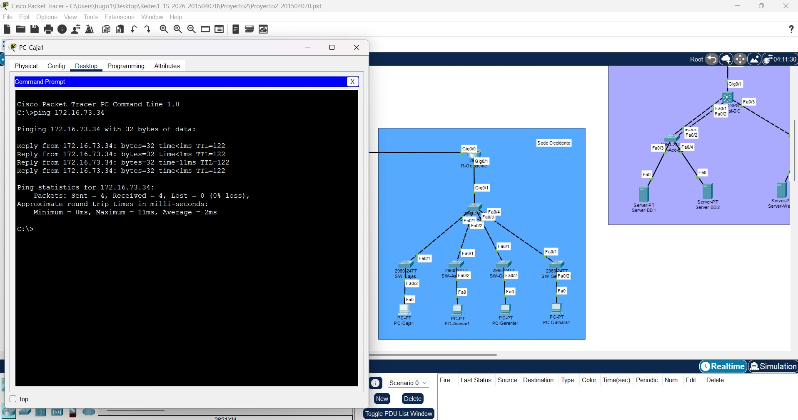
  <p><i>Demuestra: OSPF + rutas estáticas + inter-VLAN funcionando.</i></p>
</div>

### 2. Norte → Data Center
Desde **PC-Analista1** hacia **Server-Web1**:
```
ping 172.16.73.3
```

<div align="center">
  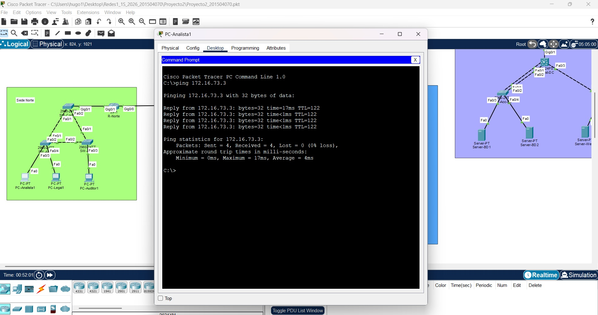
  <p><i>Demuestra: EIGRP → redistribución → rutas estáticas.</i></p>
</div>

### 3. Oriente → Data Center
Desde **PC-Boveda1** hacia **Server-NOC1**:
```
ping 172.16.73.50
```

<div align="center">
  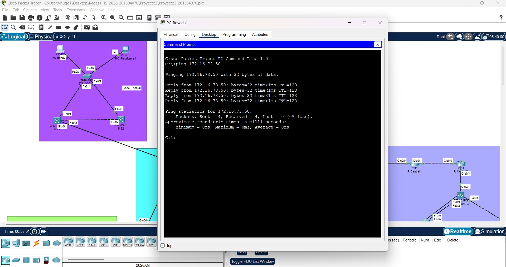
  <p><i>Demuestra: HSRP + OSPF + rutas estáticas.</i></p>
</div>

### 4. Norte → Occidente (cross-region)
Desde **PC-Legal1** hacia **PC-Caja1**:
```
ping 172.16.70.2
```

<div align="center">
  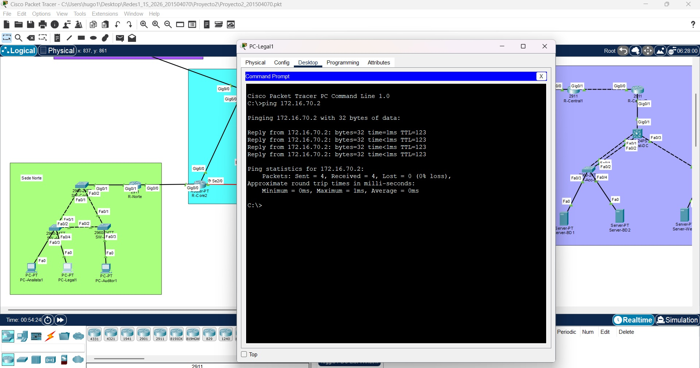
  <p><i>Demuestra: EIGRP → redistribución OSPF → Router-on-a-Stick.</i></p>
</div>

### 5. Occidente → Oriente
Desde **PC-Gerente1** hacia **PC-Plataforma1**:
```
ping 172.16.72.68
```

<div align="center">
  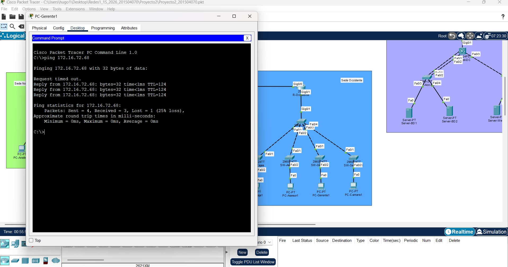
  <p><i>Demuestra: convergencia completa entre sedes no adyacentes.</i></p>
</div>

---

## Tablas de enrutamiento (show ip route) de los routers frontera, demostrando la redistribución exitosa entre OSPF, EIGRP, RIP y Estáticas.

Los **routers frontera** son los que hacen redistribución entre protocolos. Estos son los que debes documentar:

---

## 📋 Routers donde ejecutar `show ip route`

### 1. R-Core2 — redistribución OSPF ↔ EIGRP
```
R-Core2# show ip route
```

<div align="center">
  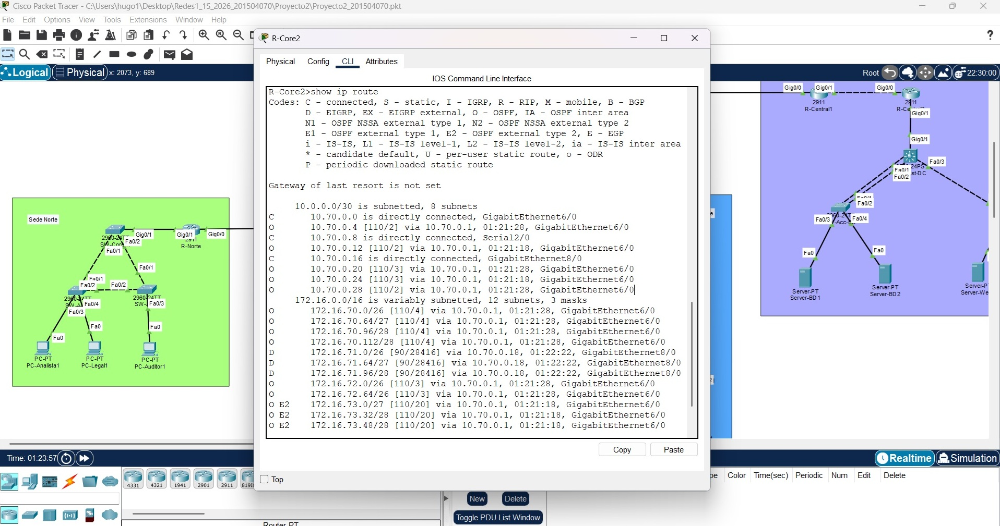
  <p><i>Demuestra: rutas `O` (OSPF) y `D` (EIGRP) coexistiendo.</i></p>
</div>

> R-Core2 es el punto de redistribución entre OSPF y EIGRP. Su tabla de enrutamiento demuestra convergencia total: las redes de Sede Norte (172.16.71.x) se aprenden por EIGRP directamente desde R-Norte, las redes del backbone y sedes Occidente/Oriente se aprenden por OSPF, y las redes del Data Center (172.16.73.x) aparecen como OSPF E2 — rutas externas redistribuidas desde las rutas estáticas configuradas en R-Central1. La coexistencia de los tres tipos de ruta en una sola tabla confirma la redistribución exitosa entre dominios.


### 2. R-Central1 — redistribución Estáticas → OSPF
```
R-Central1# show ip route
```

<div align="center">
  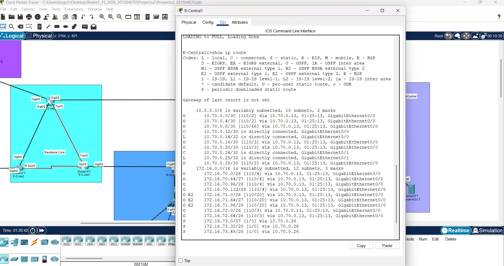
  <p><i>Demuestra: rutas `S` (estáticas hacia DC) y rutas `O` del backbone.</i></p>
</div>

> R-Central1 actúa como router frontera entre el backbone OSPF y el segmento de alta seguridad del Data Center. Su tabla confirma la redistribución bidireccional: las tres redes del DC (172.16.73.x) se mantienen como rutas estáticas locales apuntando hacia R-Central2, y simultáneamente son redistribuidas hacia OSPF para que todo el backbone las conozca como rutas externas. R-Central1 también recibe por OSPF todas las redes del backbone incluyendo las rutas de Sede Norte como O E2 — rutas EIGRP que fueron redistribuidas en R-Core2 hacia OSPF antes de llegar aquí.

### 3. R-Norte — dominio EIGRP
```
R-Norte# show ip route
```
<div align="center">
  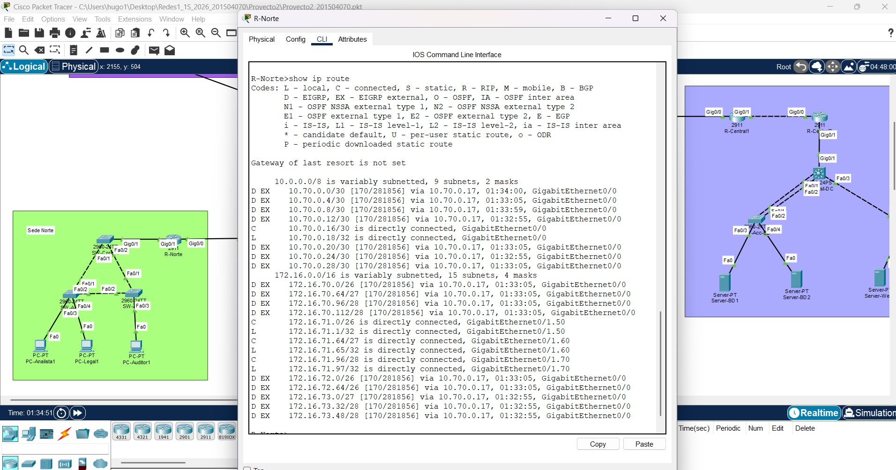
  <p><i>Demuestra: rutas `D EX` (EIGRP externo, rutas redistribuidas desde OSPF).</i></p>
</div>

> R-Norte opera exclusivamente en el dominio EIGRP. Su tabla de enrutamiento confirma que el proceso de redistribución en R-Core2 es exitoso: todas las redes externas al dominio EIGRP — incluyendo los enlaces del backbone, Sede Occidente, Sede Oriente y el Data Center — son recibidas como rutas EIGRP externas (D EX, distancia administrativa 170). Las tres VLANs locales de la sede aparecen como rutas directamente conectadas a través de las subinterfaces del Router-on-a-Stick, confirmando el correcto funcionamiento del inter-VLAN sobre el enlace troncal hacia SW-Core-N.

### 4. R-Occidente — dominio OSPF borde
```
R-Occidente# show ip route
```

<div align="center">
  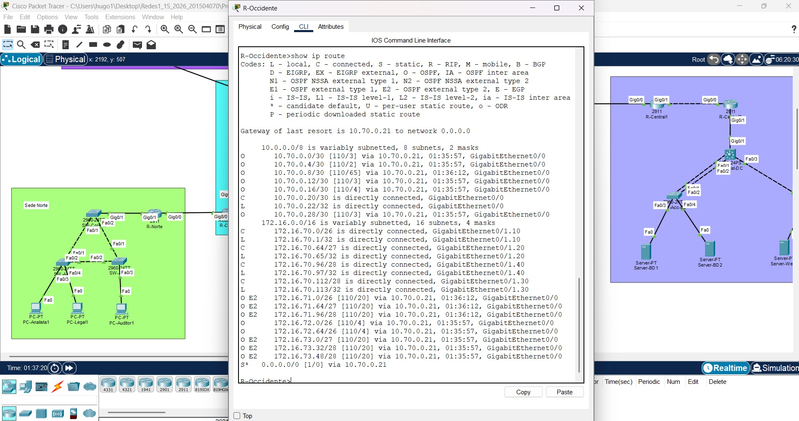
  <p><i>Demuestra: rutas `O` y `O E2` del backbone más sus redes locales `C`.</i></p>
</div>

> R-Occidente es el router de borde de Sede Occidente y opera dentro del dominio OSPF del backbone. Su tabla de enrutamiento demuestra convergencia completa: las cuatro VLANs locales están directamente conectadas a través de las subinterfaces del Router-on-a-Stick, mientras que todas las redes externas son alcanzables mediante OSPF. Las rutas de Sede Norte aparecen como O E2 — resultado de la redistribución EIGRP→OSPF en R-Core2 — y las del Data Center también como O E2 por la redistribución de estáticas en R-Central1. La ruta S* 0.0.0.0/0 hacia R-Core3 actúa como respaldo ante limitaciones de convergencia de Packet Tracer con routers 2911, garantizando conectividad total hacia el backbone en todo momento.

>>  **RIPv2 fue considerado en el diseño inicial para Sede Occidente pero fue reemplazado por OSPF** durante la implementación para garantizar convergencia estable, quedando los tres dominios como OSPF, EIGRP y Estáticas.

### 5. MS1 — frontera Oriente
```
MS1# show ip route
```
<div align="center">
  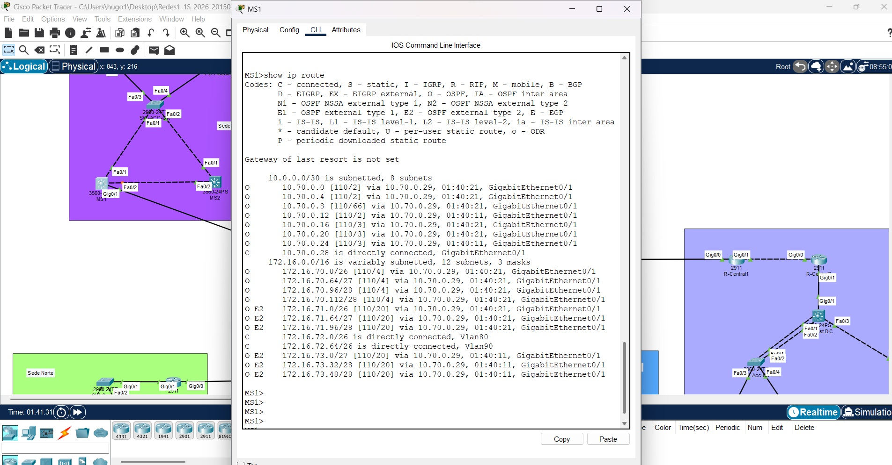
  <p><i>Demuestra: rutas `O` y `O E2` del backbone más sus VLANs `C`.</i></p>
</div>

> MS1 actúa simultáneamente como switch multicapa de Sede Oriente y como nodo OSPF del backbone. Su tabla de enrutamiento confirma visibilidad completa de toda la red: las VLANs locales de la sede (Bóveda y Plataforma) aparecen como rutas directamente conectadas a través de sus SVIs, mientras que todas las sedes remotas son alcanzables mediante OSPF. Las rutas de Sede Norte llegan como O E2 producto de la redistribución EIGRP→OSPF en R-Core2, y las del Data Center también como O E2 por redistribución de estáticas en R-Central1. Esta tabla confirma que MS1, además de proveer gateway redundante mediante HSRP, mantiene conectividad total hacia el backbone como participante activo del dominio OSPF.

---

## Pruebas de conmutación por error (demostrar qué pasa si se apaga un enlace crítico de HSRP o del anillo STP).

### 🔴 Prueba 1 — Failover HSRP (Sede Oriente)

Paso 1 — Verificar estado normal
En MS1:
```
MS1# show standby brief
```

<div align="center">
  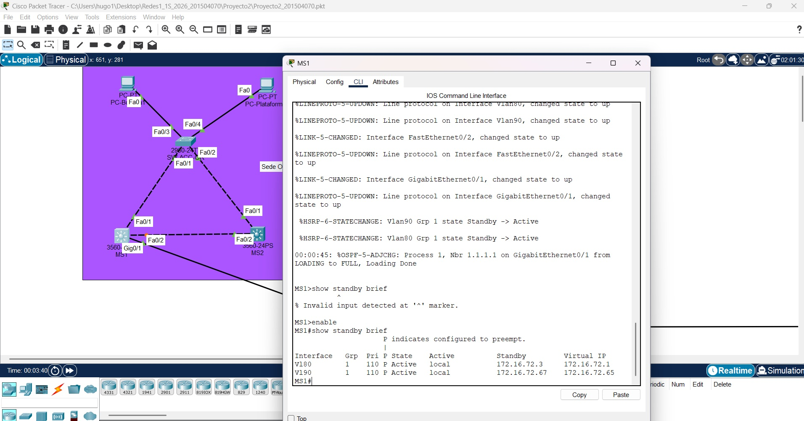
  <p><i>Muestra MS1 como Active y MS2 como Standby.</i></p>
</div>

Paso 2 — Simular la falla apagando MS1

```
MS1> enable
MS1# configure terminal
MS1(config)# interface FastEthernet0/1
MS1(config-if)# shutdown
MS1(config-if)# end
```
<div align="center">
  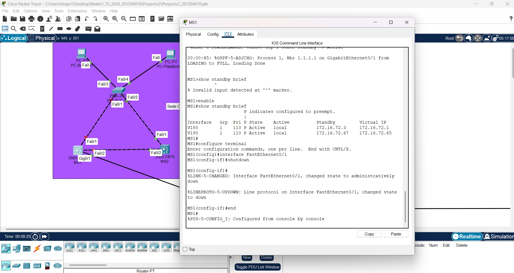
  <p><i>Se puede observar como en FastEthernet0/1 aparecen flechas rojas que indican que no esta funcionando.</i></p>
</div>

Paso 3 — Verifica que MS2 tomó el control, En MS2 inmediatamente:

```
MS2# show standby brief
```

<div align="center">
  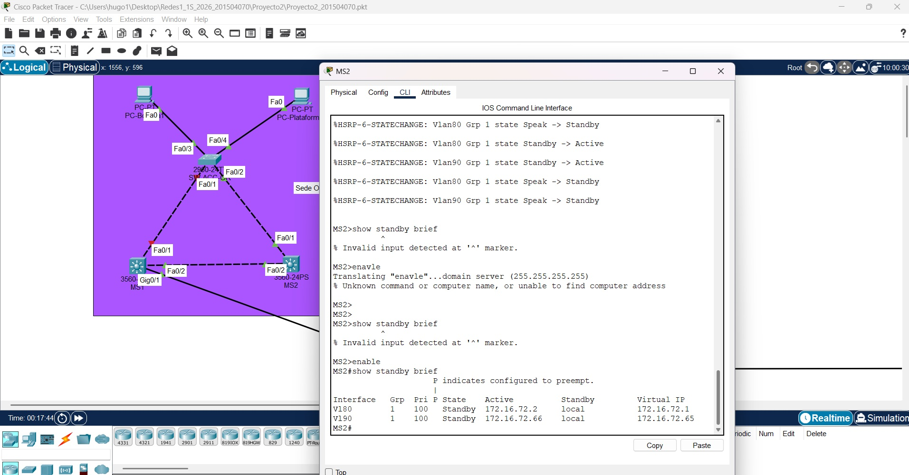
  <p><i>Muestra MS2 como Active ahora.</i></p>
</div>

Paso 4 — Verifica conectividad desde PC-Boveda1

```
ping 172.16.73.34
```
<div align="center">
  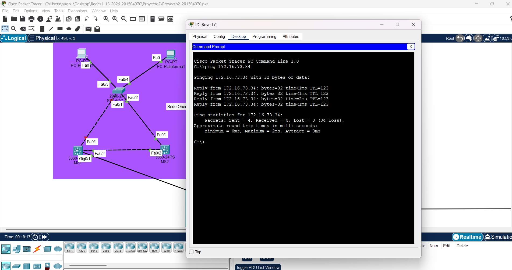
  <p><i>El ping responde exitosamente via MS2.</i></p>
</div>

Paso 5 — Restaura el enlace

```
MS1> enable
MS1# configure terminal
MS1(config)# interface FastEthernet0/1
MS1(config-if)# no shutdown
MS1(config-if)# end
```
<div align="center">
  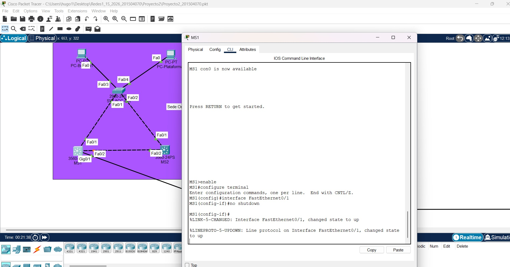
  <p><i>MS1 debe retoma el rol Active automáticamente por el preempt configurado, se puede observar como cambian las flechas de FastEthernet0/1 de rojas a verdes.</i></p>
</div>

La documentación necesita ajustarse porque el puerto BLK está en **SW-A-N2** (no en SW-A-N1), entonces la lógica de la prueba cambia ligeramente. Aquí está corregida:

---

### 🔵 Prueba 2 — Conmutación STP (Sede Norte)

**Paso 1 — Verificar estado normal**

En SW-Core-N confirma que es Root Bridge con todos los puertos en FWD:
```
SW-Core-N# show spanning-tree vlan 50
```
<div align="center">
  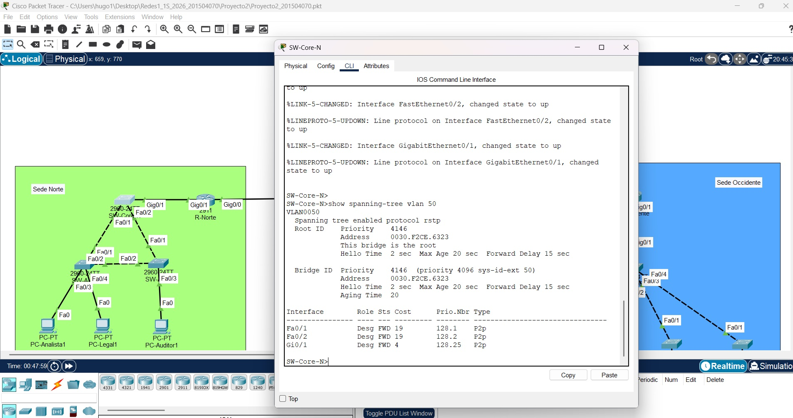
  <p><i>SW-Core-N es Root Bridge y todos sus puertos están en Desg FWD.</i></p>
</div>

En SW-A-N2 se observa el puerto bloqueado por STP para prevenir el loop:

```
SW-A-N2# show spanning-tree vlan 50
```
<div align="center">
  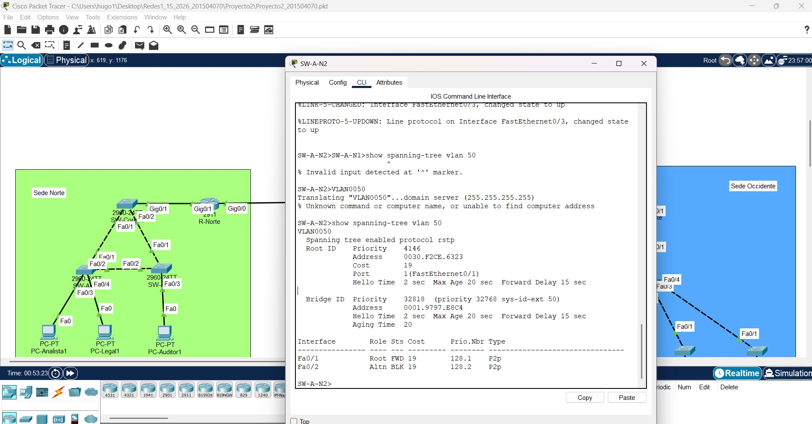
  <p><i>Fa0/2 de SW-A-N2 está en rol Altn BLK — puerto bloqueado por Rapid PVST+ para eliminar el bucle físico entre SW-A-N1 y SW-A-N2.</i></p>
</div>

**Paso 2 — Simular falla apagando el enlace principal de SW-A-N2 hacia SW-Core-N**

Se apaga `Fa0/1` de SW-A-N2 (su enlace directo hacia SW-Core-N):
```
SW-A-N2> enable
SW-A-N2# configure terminal
SW-A-N2(config)# interface FastEthernet0/1
SW-A-N2(config-if)# shutdown
SW-A-N2(config-if)# end
```

<div align="center">
  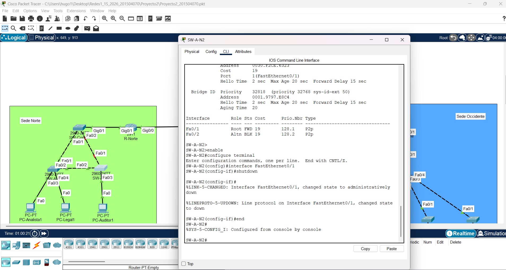
  <p><i>Se puede observar como las flechas de los enlaces de Fa0/1 de SW-A-N2 y Fa0/2 de SW-A-N2 pasan a volverse rojos lo que indica que no hay conectividad.</i></p>
</div>

**Paso 3 — Verificar que STP activó el enlace alterno**

En SW-A-N2 verifica el nuevo estado:
```
SW-A-N2# show spanning-tree vlan 50
```

<div align="center">
  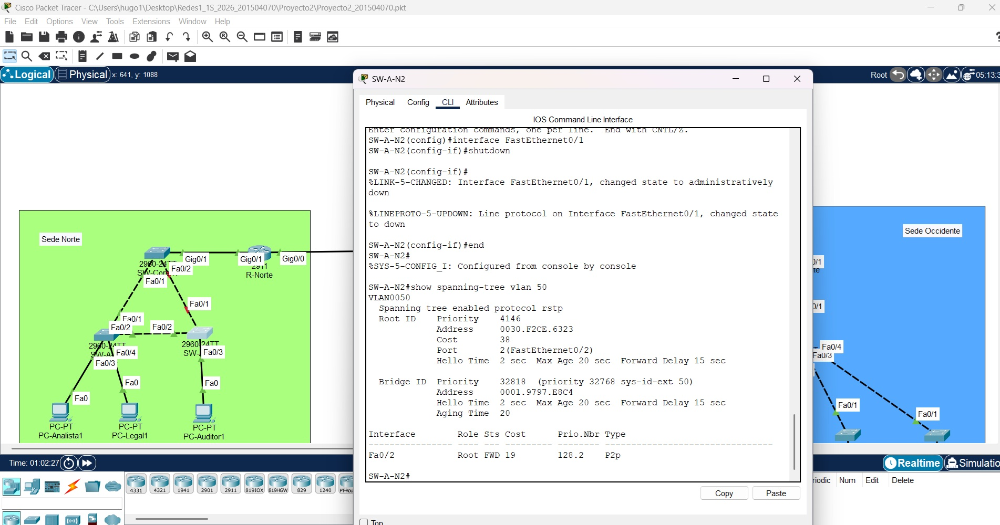
  <p><i>El puerto `Fa0/2` (bucle hacia SW-A-N1) pasó  de **Altn BLK** a **Root FWD** automáticamente. El tráfico de SW-A-N2 ahora viaja por SW-A-N1 → SW-Core-N.</i></p>
</div>

**Paso 4 — Verificar conectividad desde PC-Auditor1**

PC-Auditor1 está conectado a SW-A-N2, por lo que es el host más afectado por esta falla:
```
ping 172.16.73.34
```

<div align="center">
  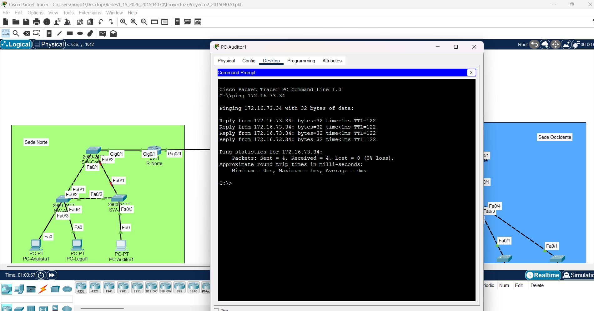
  <p><i>El ping responde exitosamente — el tráfico ahora viaja por el camino alterno: SW-A-N2 → SW-A-N1 → SW-Core-N → R-Norte → backbone.</i></p>
</div>

**Paso 5 — Restaurar el enlace**
```
SW-A-N2# configure terminal
SW-A-N2(config)# interface FastEthernet0/1
SW-A-N2(config-if)# no shutdown
SW-A-N2(config-if)# end
```

<div align="center">
  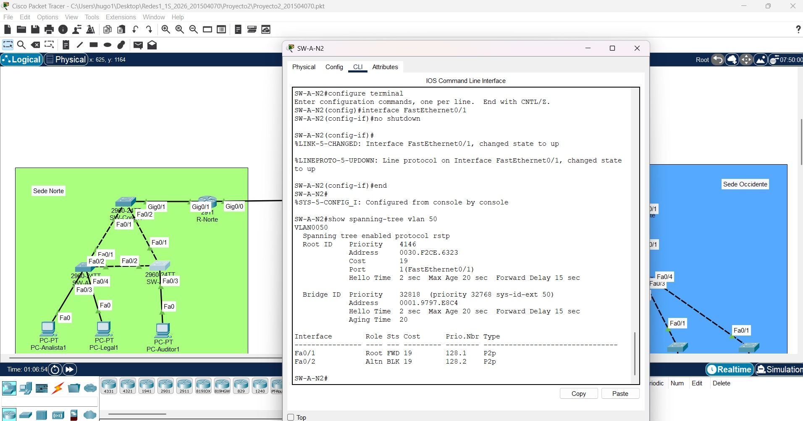
  <p><i>Rapid PVST+ restaura el estado original en segundos: `Fa0/1` vuelve a **Root FWD** y `Fa0/2` regresa a **Altn BLK**.</i></p>
</div>

---
