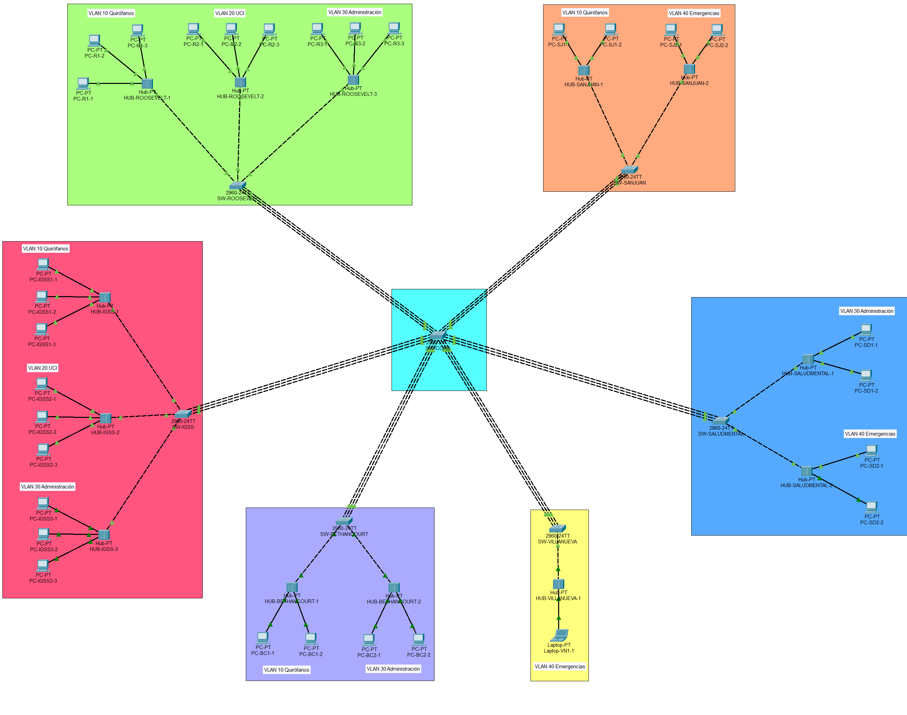
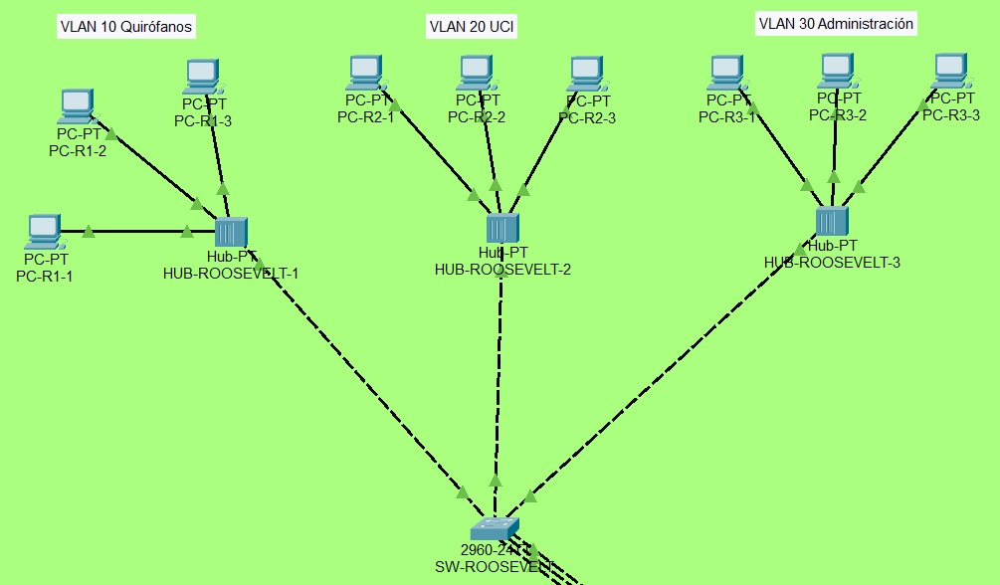
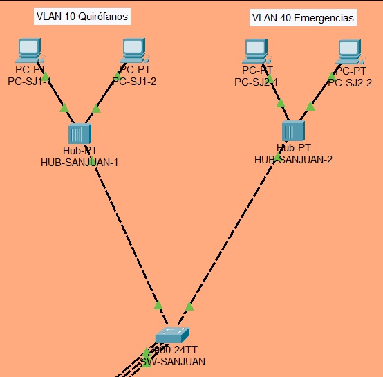
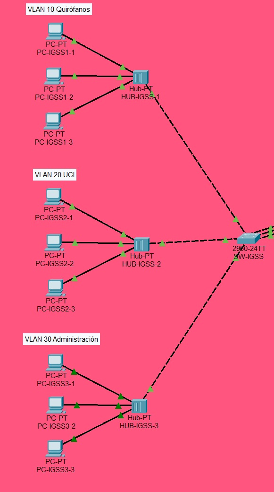
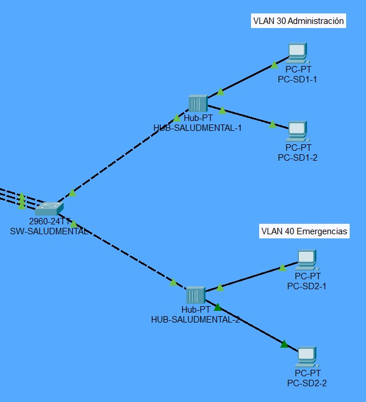
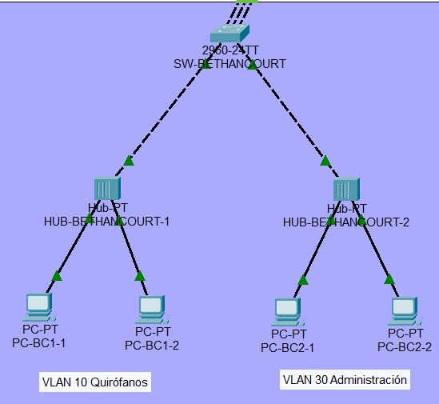
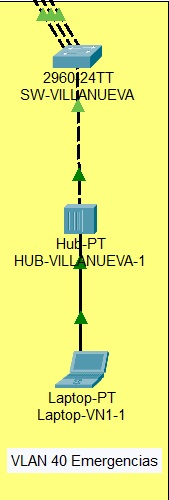

***

# Universidad de San Carlos de Guatemala
## Facultad de Ingeniería
### Ingeniería en Sistemas
#### Redes de Computadoras 1
##### Primer Semestre de 2026

| Registro académico: 201504070 | CUI: 3236666040511 |
| :--- | :--- |
| **Nombre:** Hugo Jorge Luis Perez Arana | **Proyecto:** 1 |
| **Ing.** Luis Fernando Espino Barrios | **Sección:** A |

<br />

---

# 🏥 Práctica 2 – Redes de Computadoras 1

## Topología

### Topología completa

<div align="center">
  
</div>

### Hospital Roosevelt

<div align="center">
  
</div>

### Hospital General San Juan de Dios

<div align="center">
  
</div>

### Hospital de Ginecología y Obstetricia (IGSS)

<div align="center">
  
</div>

### Hospital Nacional de Salud Mental

<div align="center">
  
</div>

### Hospital Pedro de Bethancourt

<div align="center">
  
</div>

### Hospital de Villa Nueva

<div align="center">
  
</div>

---

## Tabla de Subnetting por Área

### Datos base
- Red base propuesta: **192.168.0.0/16** (para tener espacio)
- Total hosts aprox: **169**
- VLANs activas: 4 (10, 20, 30, 40)
- Hosts por VLAN: 169 ÷ 4 ≈ **42.25** → 43 hosts por VLAN
- Máscara eficiente: **/26** → 62 hosts útiles por subred

---

### Subnetting contiguo para 4 VLANs + VLAN Nativa (99)

| VLAN | Red | Máscara | Prefijo | Gateway | Rango usable | Broadcast |
|------|-----|---------|---------|---------|--------------|-----------|
| 10 | 192.168.10.0 | 255.255.255.192 | /26 | 192.168.10.1 | .2 – .62 | .63 |
| 20 | 192.168.20.0 | 255.255.255.192 | /26 | 192.168.20.1 | .2 – .62 | .63 |
| 30 | 192.168.30.0 | 255.255.255.192 | /26 | 192.168.30.1 | .2 – .62 | .63 |
| 40 | 192.168.40.0 | 255.255.255.192 | /26 | 192.168.40.1 | .2 – .62 | .63 |
| 99 (Nativa) | 192.168.99.0 | 255.255.255.192 | /26 | 192.168.99.1 | .2 – .62 | .63 |
| 999 (Blackhole) | — | — | — | — | Sin IP | — |

✅ **Contiguas**: 10, 20, 30, 40, 99 → separadas por 10 para claridad y crecimiento.

---

### Tabla de asignación de IPs

| PC | Hub | VLAN | IP | Máscara | Gateway |
|----|-----|------|----|---------|---------|
| PC-R1-1 | HUB-ROOSEVELT-1 | 10 | 192.168.10.2 | 255.255.255.192 | 192.168.10.1 |
| PC-R1-2 | HUB-ROOSEVELT-1 | 10 | 192.168.10.3 | 255.255.255.192 | 192.168.10.1 |
| PC-R1-3 | HUB-ROOSEVELT-1 | 10 | 192.168.10.4 | 255.255.255.192 | 192.168.10.1 |
| PC-R2-1 | HUB-ROOSEVELT-2 | 20 | 192.168.20.2 | 255.255.255.192 | 192.168.20.1 |
| PC-R2-2 | HUB-ROOSEVELT-2 | 20 | 192.168.20.3 | 255.255.255.192 | 192.168.20.1 |
| PC-R2-3 | HUB-ROOSEVELT-2 | 20 | 192.168.20.4 | 255.255.255.192 | 192.168.20.1 |
| PC-R3-1 | HUB-ROOSEVELT-3 | 30 | 192.168.30.2 | 255.255.255.192 | 192.168.30.1 |
| PC-R3-2 | HUB-ROOSEVELT-3 | 30 | 192.168.30.3 | 255.255.255.192 | 192.168.30.1 |
| PC-R3-3 | HUB-ROOSEVELT-3 | 30 | 192.168.30.4 | 255.255.255.192 | 192.168.30.1 |
| PC-SJ1-1 | HUB-SANJUAN-1 | 10 | 192.168.10.5 | 255.255.255.192 | 192.168.10.1 |
| PC-SJ1-2 | HUB-SANJUAN-1 | 10 | 192.168.10.6 | 255.255.255.192 | 192.168.10.1 |
| PC-SJ2-1 | HUB-SANJUAN-2 | 40 | 192.168.40.2 | 255.255.255.192 | 192.168.40.1 |
| PC-SJ2-2 | HUB-SANJUAN-2 | 40 | 192.168.40.3 | 255.255.255.192 | 192.168.40.1 |
| PC-IGSS1-1 | HUB-IGSS-1 | 10 | 192.168.10.7 | 255.255.255.192 | 192.168.10.1 |
| PC-IGSS1-2 | HUB-IGSS-1 | 10 | 192.168.10.8 | 255.255.255.192 | 192.168.10.1 |
| PC-IGSS1-3 | HUB-IGSS-1 | 10 | 192.168.10.9 | 255.255.255.192 | 192.168.10.1 |
| PC-IGSS2-1 | HUB-IGSS-2 | 20 | 192.168.20.5 | 255.255.255.192 | 192.168.20.1 |
| PC-IGSS2-2 | HUB-IGSS-2 | 20 | 192.168.20.6 | 255.255.255.192 | 192.168.20.1 |
| PC-IGSS2-3 | HUB-IGSS-2 | 20 | 192.168.20.7 | 255.255.255.192 | 192.168.20.1 |
| PC-IGSS3-1 | HUB-IGSS-3 | 30 | 192.168.30.5 | 255.255.255.192 | 192.168.30.1 |
| PC-IGSS3-2 | HUB-IGSS-3 | 30 | 192.168.30.6 | 255.255.255.192 | 192.168.30.1 |
| PC-IGSS3-3 | HUB-IGSS-3 | 30 | 192.168.30.7 | 255.255.255.192 | 192.168.30.1 |
| PC-SD1-1 | HUB-SALUDMENTAL-1 | 30 | 192.168.30.8 | 255.255.255.192 | 192.168.30.1 |
| PC-SD1-2 | HUB-SALUDMENTAL-1 | 30 | 192.168.30.9 | 255.255.255.192 | 192.168.30.1 |
| PC-SD2-1 | HUB-SALUDMENTAL-2 | 40 | 192.168.40.4 | 255.255.255.192 | 192.168.40.1 |
| PC-SD2-2 | HUB-SALUDMENTAL-2 | 40 | 192.168.40.5 | 255.255.255.192 | 192.168.40.1 |
| PC-BC1-1 | HUB-BETHANCOURT-1 | 10 | 192.168.10.10 | 255.255.255.192 | 192.168.10.1 |
| PC-BC1-2 | HUB-BETHANCOURT-1 | 10 | 192.168.10.11 | 255.255.255.192 | 192.168.10.1 |
| PC-BC2-1 | HUB-BETHANCOURT-2 | 30 | 192.168.30.10 | 255.255.255.192 | 192.168.30.1 |
| PC-BC2-2 | HUB-BETHANCOURT-2 | 30 | 192.168.30.11 | 255.255.255.192 | 192.168.30.1 |
| Laptop-VN1-1 | HUB-VILLANUEVA-1 | 40 | 192.168.40.6 | 255.255.255.192 | 192.168.40.1 |

---


## Guía paso a paso – Carnet 201504070

---

### 1. Selección de Hospitales de Guatemala

Para el desarrollo de la práctica, se seleccionaron seis hospitales reales del área metropolitana de Guatemala, cuyas características de infraestructura de red se detallan en la siguiente tabla:

| # | Hospital | Hosts Mínimos | Dominios de Colisión |
|---|----------|--------------|----------------------|
| H1 | Hospital Roosevelt | 63 | 3 dominios |
| H2 | Hospital General San Juan de Dios | 25 | 2 dominios |
| H3 | Hospital de Ginecología y Obstetricia (IGSS) | 32 | 3 dominios |
| H4 | Hospital Nacional de Salud Mental | 15 | 2 dominios |
| H5 | Hospital Pedro de Bethancourt | 26 | 2 dominios |
| H6 | Hospital de Villa Nueva | 8 | 1 dominio |

---

### 2. Topología a usar: **Estrella Extendida (Híbrida)**

Se optó por una topología de **Estrella Extendida** debido a sus ventajas en entornos médicos reales:
- **Centralización:** Un switch central (core) conecta a cada hospital.
- **Segmentación:** Dentro de cada hospital, se utiliza su propio switch principal.
- **Administración y Redundancia:** Es una de las más usadas en redes médicas por su facilidad de administración y la posibilidad de implementar redundancia mediante EtherChannel.

**Diagrama conceptual:**
```
         [SWITCH CORE CENTRAL]
        /    |    |    |    \
      H1    H2   H3   H4   H5
                             \
                             H6
```
*En Packet Tracer, la implementación consistirá en un switch central conectado a cada switch principal de hospital.*

---

### 3. Diseño de Dominios de Colisión por Hospital

Para el diseño de los dominios de colisión, se aplicaron los principios fundamentales de networking:
- **Switch:** Cada puerto es un dominio de colisión separado.
- **Hub:** Todos los puertos comparten un único dominio de colisión.

La solución técnica para cada hospital se detalla a continuación:

| Hospital | Dominios requeridos | Solución técnica |
|----------|-------------------|-----------------|
| H1 (63 hosts, 3 dominios) | 3 | 1 Switch principal + 3 Hubs (un hub por dominio, ~21 PCs por hub) |
| H2 (25 hosts, 2 dominios) | 2 | 1 Switch + 2 Hubs (~12-13 PCs por hub) |
| H3 (32 hosts, 3 dominios) | 3 | 1 Switch + 3 Hubs (~10-11 PCs por hub) |
| H4 (15 hosts, 2 dominios) | 2 | 1 Switch + 2 Hubs (7 y 8 PCs) |
| H5 (26 hosts, 2 dominios) | 2 | 1 Switch + 2 Hubs (13 PCs por hub) |
| H6 (8 hosts, 1 dominio) | 1 | Solo 1 Hub (todos los PCs al hub) |

> 💡 **Lógica:** El switch principal de cada hospital conecta los hubs entre sí. Cada puerto del switch que se conecta a un hub constituye un dominio de colisión independiente. Por lo tanto, al conectar 3 hubs, se obtienen 3 dominios de colisión.

---

### 4. VLANs (Áreas Funcionales)

Se definieron 4 áreas funcionales para todos los hospitales. El valor de `X` correspondiente al carnet del estudiante es **0**, por lo que los IDs de VLAN son el resultado de sumar 0 al número del área.

| Área | Nombre | ID VLAN (área + 0) |
|------|--------|-------------------|
| Área 1 | Quirófanos | VLAN 10 |
| Área 2 | UCI (Cuidados Intensivos) | VLAN 20 |
| Área 3 | Administración | VLAN 30 |
| Área 4 | Emergencias | VLAN 40 |
| Nativa | Troncales (nativa) | VLAN 99 |
| Blackhole | Puertos no usados | VLAN 999 |

---

### 5. Subnetting

Se utilizó la red base **192.168.0.0** para crear una subred por cada VLAN.

Considerando que el hospital con mayor cantidad de hosts es el H1 con 63, se determinó que una máscara **/25** (255.255.255.128), que ofrece 126 hosts útiles, es la más adecuada. Para mantener la consistencia en la documentación y administración, se aplicó la misma máscara a todas las VLANs.

| VLAN | Área | Red | Máscara | Gateway | Rango útil |
|------|------|-----|---------|---------|------------|
| VLAN 10 | Quirófanos | 192.168.10.0 | /26 (255.255.255.192) | 192.168.10.1 | .2 – .126 |
| VLAN 20 | UCI | 192.168.20.0 | /26 | 192.168.20.1 | .2 – .126 |
| VLAN 30 | Administración | 192.168.30.0 | /26 | 192.168.30.1 | .2 – .126 |
| VLAN 40 | Emergencias | 192.168.40.0 | /26 | 192.168.40.1 | .2 – .126 |

---

### 6. VTP

Para la administración centralizada de las VLANs, se definió la siguiente configuración VTP:

| Parámetro | Valor |
|-----------|-------|
| Dominio | `201504070` |
| Contraseña por área | `area1`, `area2`, `area3`, `area4` |
| Switch Servidor VTP | Switch principal de cada hospital (o uno central) |
| Los demás switches | Modo **cliente** |

> 💡 **Recomendación:** Se sugiere simplificar la configuración estableciendo **un solo servidor VTP en el switch CORE central** y configurando todos los demás switches como clientes. Esto facilita la administración y evita posibles conflictos.

---

### 7. STP (Rapid PVST+)

Para garantizar una topología sin bucles y con convergencia rápida:
- Se activará **Rapid PVST+** en todos los switches.
- El **switch CORE central** será designado como **Root Bridge** para todas las VLANs.
- Esto se logrará asignándole la prioridad más baja (valor 4096 o usando el comando `primary`).

---

### 8. EtherChannel (PAgP)

Con el fin de aumentar el ancho de banda y proporcionar redundancia:
- Entre el **switch CORE** y el **switch principal de cada hospital** se agruparán **3 cables físicos** en un único canal lógico.
- Se utilizará el protocolo **PAgP** para la negociación del enlace agregado.

---

### 9. Topología armada en Packet Tracer

#### Tabla 2 – Conexiones SW-CORE a Switches de Hospital

| Puerto SW-CORE | Dispositivo Destino | Puerto Destino | Propósito |
|----------------|-------------------|----------------|-----------|
| Fa0/1 | SW-ROOSEVELT | Fa0/1 | EtherChannel |
| Fa0/2 | SW-ROOSEVELT | Fa0/2 | EtherChannel |
| Fa0/3 | SW-ROOSEVELT | Fa0/3 | EtherChannel |
| Fa0/4 | SW-SANJUAN | Fa0/1 | EtherChannel |
| Fa0/5 | SW-SANJUAN | Fa0/2 | EtherChannel |
| Fa0/6 | SW-SANJUAN | Fa0/3 | EtherChannel |
| Fa0/7 | SW-IGSS | Fa0/1 | EtherChannel |
| Fa0/8 | SW-IGSS | Fa0/2 | EtherChannel |
| Fa0/9 | SW-IGSS | Fa0/3 | EtherChannel |
| Fa0/10 | SW-SALUDMENTAL | Fa0/1 | EtherChannel |
| Fa0/11 | SW-SALUDMENTAL | Fa0/2 | EtherChannel |
| Fa0/12 | SW-SALUDMENTAL | Fa0/3 | EtherChannel |
| Fa0/13 | SW-BETHANCOURT | Fa0/1 | EtherChannel |
| Fa0/14 | SW-BETHANCOURT | Fa0/2 | EtherChannel |
| Fa0/15 | SW-BETHANCOURT | Fa0/3 | EtherChannel |
| Fa0/16 | SW-VILLANUEVA | Fa0/1 | EtherChannel |
| Fa0/17 | SW-VILLANUEVA | Fa0/2 | EtherChannel |
| Fa0/18 | SW-VILLANUEVA | Fa0/3 | EtherChannel |

---

#### Tabla 3 – Conexiones Switches de Hospital a Hubs

| Switch Hospital | Puerto Switch | Hub Destino | Puerto Hub |
|----------------|---------------|-------------|------------|
| SW-ROOSEVELT | Fa0/4 | HUB-ROOSEVELT-1 | Fa0 |
| SW-ROOSEVELT | Fa0/5 | HUB-ROOSEVELT-2 | Fa0 |
| SW-ROOSEVELT | Fa0/6 | HUB-ROOSEVELT-3 | Fa0 |
| SW-SANJUAN | Fa0/4 | HUB-SANJUAN-1 | Fa0 |
| SW-SANJUAN | Fa0/5 | HUB-SANJUAN-2 | Fa0 |
| SW-IGSS | Fa0/4 | HUB-IGSS-1 | Fa0 |
| SW-IGSS | Fa0/5 | HUB-IGSS-2 | Fa0 |
| SW-IGSS | Fa0/6 | HUB-IGSS-3 | Fa0 |
| SW-SALUDMENTAL | Fa0/4 | HUB-SALUDMENTAL-1 | Fa0 |
| SW-SALUDMENTAL | Fa0/5 | HUB-SALUDMENTAL-2 | Fa0 |
| SW-BETHANCOURT | Fa0/4 | HUB-BETHANCOURT-1 | Fa0 |
| SW-BETHANCOURT | Fa0/5 | HUB-BETHANCOURT-2 | Fa0 |
| SW-VILLANUEVA | Fa0/4 | HUB-VILLANUEVA-1 | Fa0 |

---

#### Tabla 4 – Conexiones Hubs a PCs

| Hub | Puerto Hub | PC/Laptop |
|-----|------------|-----------|
| HUB-ROOSEVELT-1 | Fa0 | PC-R1-1 |
| HUB-ROOSEVELT-1 | Fa0 | PC-R1-2 |
| HUB-ROOSEVELT-1 | Fa0 | PC-R1-3 |
| HUB-ROOSEVELT-2 | Fa0 | PC-R2-1 |
| HUB-ROOSEVELT-2 | Fa0 | PC-R2-2 |
| HUB-ROOSEVELT-2 | Fa0 | PC-R2-3 |
| HUB-ROOSEVELT-3 | Fa0 | PC-R3-1 |
| HUB-ROOSEVELT-3 | Fa0 | PC-R3-2 |
| HUB-ROOSEVELT-3 | Fa0 | PC-R3-3 |
| HUB-SANJUAN-1 | Fa0 | PC-SJ1-1 |
| HUB-SANJUAN-1 | Fa0 | PC-SJ1-2 |
| HUB-SANJUAN-2 | Fa0 | PC-SJ2-1 |
| HUB-SANJUAN-2 | Fa0 | PC-SJ2-2 |
| HUB-IGSS-1 | Fa0 | PC-IGSS1-1 |
| HUB-IGSS-1 | Fa0 | PC-IGSS1-2 |
| HUB-IGSS-1 | Fa0 | PC-IGSS1-3 |
| HUB-IGSS-2 | Fa0 | PC-IGSS2-1 |
| HUB-IGSS-2 | Fa0 | PC-IGSS2-2 |
| HUB-IGSS-2 | Fa0 | PC-IGSS2-3 |
| HUB-IGSS-3 | Fa0 | PC-IGSS3-1 |
| HUB-IGSS-3 | Fa0 | PC-IGSS3-2 |
| HUB-IGSS-3 | Fa0 | PC-IGSS3-3 |
| HUB-SALUDMENTAL-1 | Fa0 | PC-SD1-1 |
| HUB-SALUDMENTAL-1 | Fa0 | PC-SD1-2 |
| HUB-SALUDMENTAL-2 | Fa0 | PC-SD2-1 |
| HUB-SALUDMENTAL-2 | Fa0 | PC-SD2-2 |
| HUB-BETHANCOURT-1 | Fa0 | PC-BC1-1 |
| HUB-BETHANCOURT-1 | Fa0 | PC-BC1-2 |
| HUB-BETHANCOURT-2 | Fa0 | PC-BC2-1 |
| HUB-BETHANCOURT-2 | Fa0 | PC-BC2-2 |
| HUB-VILLANUEVA-1 | Fa0 | Laptop-VN1-1 |

---

#### Tabla 5 – Asignación de VLANs por Hub

La lógica usada: cada hub representa un área funcional distinta dentro del hospital.

| Hospital | Hub | VLAN Asignada | Área |
|----------|-----|--------------|------|
| Roosevelt | HUB-ROOSEVELT-1 | VLAN 10 | Quirófanos |
| Roosevelt | HUB-ROOSEVELT-2 | VLAN 20 | UCI |
| Roosevelt | HUB-ROOSEVELT-3 | VLAN 30 | Administración |
| San Juan de Dios | HUB-SANJUAN-1 | VLAN 10 | Quirófanos |
| San Juan de Dios | HUB-SANJUAN-2 | VLAN 40 | Emergencias |
| IGSS | HUB-IGSS-1 | VLAN 10 | Quirófanos |
| IGSS | HUB-IGSS-2 | VLAN 20 | UCI |
| IGSS | HUB-IGSS-3 | VLAN 30 | Administración |
| Salud Mental | HUB-SALUDMENTAL-1 | VLAN 30 | Administración |
| Salud Mental | HUB-SALUDMENTAL-2 | VLAN 40 | Emergencias |
| Bethancourt | HUB-BETHANCOURT-1 | VLAN 10 | Quirófanos |
| Bethancourt | HUB-BETHANCOURT-2 | VLAN 30 | Administración |
| Villa Nueva | HUB-VILLANUEVA-1 | VLAN 40 | Emergencias |

---

#### Tabla 6 – Asignación de IPs a todas las PCs

| PC/Laptop | Hub | VLAN | IP | Máscara | Gateway |
|-----------|-----|------|----|---------|---------|
| PC-R1-1 | HUB-ROOSEVELT-1 | 10 | 192.168.10.2 | 255.255.255.128 | 192.168.10.1 |
| PC-R1-2 | HUB-ROOSEVELT-1 | 10 | 192.168.10.3 | 255.255.255.128 | 192.168.10.1 |
| PC-R1-3 | HUB-ROOSEVELT-1 | 10 | 192.168.10.4 | 255.255.255.128 | 192.168.10.1 |
| PC-R2-1 | HUB-ROOSEVELT-2 | 20 | 192.168.20.2 | 255.255.255.128 | 192.168.20.1 |
| PC-R2-2 | HUB-ROOSEVELT-2 | 20 | 192.168.20.3 | 255.255.255.128 | 192.168.20.1 |
| PC-R2-3 | HUB-ROOSEVELT-2 | 20 | 192.168.20.4 | 255.255.255.128 | 192.168.20.1 |
| PC-R3-1 | HUB-ROOSEVELT-3 | 30 | 192.168.30.2 | 255.255.255.128 | 192.168.30.1 |
| PC-R3-2 | HUB-ROOSEVELT-3 | 30 | 192.168.30.3 | 255.255.255.128 | 192.168.30.1 |
| PC-R3-3 | HUB-ROOSEVELT-3 | 30 | 192.168.30.4 | 255.255.255.128 | 192.168.30.1 |
| PC-SJ1-1 | HUB-SANJUAN-1 | 10 | 192.168.10.5 | 255.255.255.128 | 192.168.10.1 |
| PC-SJ1-2 | HUB-SANJUAN-1 | 10 | 192.168.10.6 | 255.255.255.128 | 192.168.10.1 |
| PC-SJ2-1 | HUB-SANJUAN-2 | 40 | 192.168.40.2 | 255.255.255.128 | 192.168.40.1 |
| PC-SJ2-2 | HUB-SANJUAN-2 | 40 | 192.168.40.3 | 255.255.255.128 | 192.168.40.1 |
| PC-IGSS1-1 | HUB-IGSS-1 | 10 | 192.168.10.7 | 255.255.255.128 | 192.168.10.1 |
| PC-IGSS1-2 | HUB-IGSS-1 | 10 | 192.168.10.8 | 255.255.255.128 | 192.168.10.1 |
| PC-IGSS1-3 | HUB-IGSS-1 | 10 | 192.168.10.9 | 255.255.255.128 | 192.168.10.1 |
| PC-IGSS2-1 | HUB-IGSS-2 | 20 | 192.168.20.5 | 255.255.255.128 | 192.168.20.1 |
| PC-IGSS2-2 | HUB-IGSS-2 | 20 | 192.168.20.6 | 255.255.255.128 | 192.168.20.1 |
| PC-IGSS2-3 | HUB-IGSS-2 | 20 | 192.168.20.7 | 255.255.255.128 | 192.168.20.1 |
| PC-IGSS3-1 | HUB-IGSS-3 | 30 | 192.168.30.5 | 255.255.255.128 | 192.168.30.1 |
| PC-IGSS3-2 | HUB-IGSS-3 | 30 | 192.168.30.6 | 255.255.255.128 | 192.168.30.1 |
| PC-IGSS3-3 | HUB-IGSS-3 | 30 | 192.168.30.7 | 255.255.255.128 | 192.168.30.1 |
| PC-SD1-1 | HUB-SALUDMENTAL-1 | 30 | 192.168.30.8 | 255.255.255.128 | 192.168.30.1 |
| PC-SD1-2 | HUB-SALUDMENTAL-1 | 30 | 192.168.30.9 | 255.255.255.128 | 192.168.30.1 |
| PC-SD2-1 | HUB-SALUDMENTAL-2 | 40 | 192.168.40.4 | 255.255.255.128 | 192.168.40.1 |
| PC-SD2-2 | HUB-SALUDMENTAL-2 | 40 | 192.168.40.5 | 255.255.255.128 | 192.168.40.1 |
| PC-BC1-1 | HUB-BETHANCOURT-1 | 10 | 192.168.10.10 | 255.255.255.128 | 192.168.10.1 |
| PC-BC1-2 | HUB-BETHANCOURT-1 | 10 | 192.168.10.11 | 255.255.255.128 | 192.168.10.1 |
| PC-BC2-1 | HUB-BETHANCOURT-2 | 30 | 192.168.30.10 | 255.255.255.128 | 192.168.30.1 |
| PC-BC2-2 | HUB-BETHANCOURT-2 | 30 | 192.168.30.11 | 255.255.255.128 | 192.168.30.1 |
| Laptop-VN1-1 | HUB-VILLANUEVA-1 | 40 | 192.168.40.6 | 255.255.255.128 | 192.168.40.1 |

---

## Comandos de configuración

### SW-CORE (Switch Principal Central)

#### Configuración básica

```cisco
enable
configure terminal

hostname SW-CORE
enable secret 201504070
line console 0
password 201504070
login
exit
line vty 0 4
password 201504070
login
exit
```

#### Crear VLANs

```cisco
vlan 10
name Quirofanos
exit
vlan 20
name UCI
exit
vlan 30
name Administracion
exit
vlan 40
name Emergencias
exit
vlan 99
name Nativa
exit
vlan 999
name Blackhole
exit
```

#### Configurar VTP (Servidor)

```cisco
vtp mode server
vtp domain 201504070
vtp password area1
```

#### Configurar Rapid PVST+

```cisco
spanning-tree mode rapid-pvst
```

#### Root Bridge para todas las VLANs

```cisco
spanning-tree vlan 10 priority 4096
spanning-tree vlan 20 priority 4096
spanning-tree vlan 30 priority 4096
spanning-tree vlan 40 priority 4096
```

#### EtherChannel hacia SW-ROOSEVELT (Fa0/1-3) con PAgP

```cisco
interface range Fa0/1-3
channel-group 1 mode desirable
exit
```

#### EtherChannel hacia SW-SANJUAN (Fa0/4-6) con PAgP

```cisco
interface range Fa0/4-6
channel-group 2 mode desirable
exit
```

#### EtherChannel hacia SW-IGSS (Fa0/7-9) con PAgP

```cisco
interface range Fa0/7-9
channel-group 3 mode desirable
exit
```

#### EtherChannel hacia SW-SALUDMENTAL (Fa0/10-12) con PAgP

```cisco
interface range Fa0/10-12
channel-group 4 mode desirable
exit
```

#### EtherChannel hacia SW-BETHANCOURT (Fa0/13-15) con PAgP

```cisco
interface range Fa0/13-15
channel-group 5 mode desirable
exit
```

#### EtherChannel hacia SW-VILLANUEVA (Fa0/16-18) con PAgP

```cisco
interface range Fa0/16-18
channel-group 6 mode desirable
exit
```

#### Configurar Port-Channels como troncales con VLAN nativa 99

```cisco
interface Port-channel1
switchport mode trunk
switchport trunk native vlan 99
switchport trunk allowed vlan 10,20,30,40,99
exit

interface Port-channel2
switchport mode trunk
switchport trunk native vlan 99
switchport trunk allowed vlan 10,20,30,40,99
exit

interface Port-channel3
switchport mode trunk
switchport trunk native vlan 99
switchport trunk allowed vlan 10,20,30,40,99
exit

interface Port-channel4
switchport mode trunk
switchport trunk native vlan 99
switchport trunk allowed vlan 10,20,30,40,99
exit

interface Port-channel5
switchport mode trunk
switchport trunk native vlan 99
switchport trunk allowed vlan 10,20,30,40,99
exit

interface Port-channel6
switchport mode trunk
switchport trunk native vlan 99
switchport trunk allowed vlan 10,20,30,40,99
exit
```

#### Puertos no utilizados a VLAN Blackhole (Fa0/19-24)

```cisco
interface range Fa0/19-24
switchport mode access
switchport access vlan 999
shutdown
exit

end
write memory
```

---

### SW-ROOSEVELT

#### Configuración básica

```cisco
enable
configure terminal
hostname SW-ROOSEVELT
enable secret 201504070
line console 0
password 201504070
login
exit
line vty 0 4
password 201504070
login
exit
```

#### VTP Cliente

```cisco
vtp mode client
vtp domain 201504070
vtp password area1
```

#### Rapid PVST+

```cisco
spanning-tree mode rapid-pvst
```

#### EtherChannel hacia SW-CORE (Fa0/1-3)

```cisco
interface range Fa0/1-3
channel-group 1 mode desirable
exit

interface Port-channel1
switchport mode trunk
switchport trunk native vlan 99
switchport trunk allowed vlan 10,20,30,40,99
exit
```

#### Puerto hacia HUB-ROOSEVELT-1 → VLAN 10 Quirófanos

```cisco
interface Fa0/4
switchport mode access
switchport access vlan 10
exit
```

#### Puerto hacia HUB-ROOSEVELT-2 → VLAN 20 UCI

```cisco
interface Fa0/5
switchport mode access
switchport access vlan 20
exit
```

#### Puerto hacia HUB-ROOSEVELT-3 → VLAN 30 Administración

```cisco
interface Fa0/6
switchport mode access
switchport access vlan 30
exit
```

#### Puertos no utilizados a VLAN Blackhole

```cisco
interface range Fa0/7-24
switchport mode access
switchport access vlan 999
shutdown
exit

end
write memory
```

---

### SW-SANJUAN

#### Configuración basica

```cisco
enable
configure terminal

hostname SW-SANJUAN
enable secret 201504070
line console 0
password 201504070
login
exit
line vty 0 4
password 201504070
login
exit
```

#### VTP Cliente

```cisco
vtp mode client
vtp domain 201504070
vtp password area1
```

#### Rapid PVST+

```cisco
spanning-tree mode rapid-pvst
```

#### EtherChannel hacia SW-CORE

```cisco
interface range Fa0/1-3
channel-group 1 mode desirable
exit

interface Port-channel1
switchport mode trunk
switchport trunk native vlan 99
switchport trunk allowed vlan 10,20,30,40,99
exit
```

#### Puerto hacia HUB-SANJUAN-1 → VLAN 10 Quirófanos

```cisco
interface Fa0/4
switchport mode access
switchport access vlan 10
exit
```

#### Puerto hacia HUB-SANJUAN-2 → VLAN 40 Emergencias

```cisco
interface Fa0/5
switchport mode access
switchport access vlan 40
exit
```

#### Puertos no utilizados

```cisco
interface range Fa0/6-24
switchport mode access
switchport access vlan 999
shutdown
exit

end
write memory
```

---

### SW-IGSS

#### Configuración basica

```cisco
enable
configure terminal

hostname SW-IGSS
enable secret 201504070
line console 0
password 201504070
login
exit
line vty 0 4
password 201504070
login
exit
```

#### VTP Cliente

```cisco
vtp mode client
vtp domain 201504070
vtp password area1
```

#### Rapid PVST+

```cisco
spanning-tree mode rapid-pvst
```

#### EtherChannel hacia SW-CORE

```cisco
interface range Fa0/1-3
channel-group 1 mode desirable
exit

interface Port-channel1
switchport mode trunk
switchport trunk native vlan 99
switchport trunk allowed vlan 10,20,30,40,99
exit
```

#### Puerto hacia HUB-IGSS-1 → VLAN 10 Quirófanos

```cisco
interface Fa0/4
switchport mode access
switchport access vlan 10
exit
```

#### Puerto hacia HUB-IGSS-2 → VLAN 20 UCI

```cisco
interface Fa0/5
switchport mode access
switchport access vlan 20
exit
```

#### Puerto hacia HUB-IGSS-3 → VLAN 30 Administración

```cisco
interface Fa0/6
switchport mode access
switchport access vlan 30
exit
```

#### Puertos no utilizados

```cisco
interface range Fa0/7-24
switchport mode access
switchport access vlan 999
shutdown
exit

end
write memory
```

---

### SW-SALUDMENTAL

#### Configuración basica

```cisco
enable
configure terminal

hostname SW-SALUDMENTAL
enable secret 201504070
line console 0
password 201504070
login
exit
line vty 0 4
password 201504070
login
exit
```

#### VTP Cliente

```cisco
vtp mode client
vtp domain 201504070
vtp password area1
```

#### Rapid PVST+

```cisco
spanning-tree mode rapid-pvst
```

#### EtherChannel hacia SW-CORE

```cisco
interface range Fa0/1-3
channel-group 1 mode desirable
exit

interface Port-channel1
switchport mode trunk
switchport trunk native vlan 99
switchport trunk allowed vlan 10,20,30,40,99
exit
```

#### Puerto hacia HUB-SALUDMENTAL-1 → VLAN 30 Administración

```cisco
interface Fa0/4
switchport mode access
switchport access vlan 30
exit
```

#### Puerto hacia HUB-SALUDMENTAL-2 → VLAN 40 Emergencias

```cisco
interface Fa0/5
switchport mode access
switchport access vlan 40
exit
```

#### Puertos no utilizados

```cisco
interface range Fa0/6-24
switchport mode access
switchport access vlan 999
shutdown
exit

end
write memory
```

---

### SW-BETHANCOURT

#### Configuración basica

```cisco
enable
configure terminal

hostname SW-BETHANCOURT
enable secret 201504070
line console 0
password 201504070
login
exit
line vty 0 4
password 201504070
login
exit
```

#### VTP Cliente

```cisco
vtp mode client
vtp domain 201504070
vtp password area1
```

#### Rapid PVST+

```cisco
spanning-tree mode rapid-pvst
```

#### EtherChannel hacia SW-CORE

```cisco
interface range Fa0/1-3
channel-group 1 mode desirable
exit

interface Port-channel1
switchport mode trunk
switchport trunk native vlan 99
switchport trunk allowed vlan 10,20,30,40,99
exit
```

#### Puerto hacia HUB-BETHANCOURT-1 → VLAN 10 Quirófanos

```cisco
interface Fa0/4
switchport mode access
switchport access vlan 10
exit
```

#### Puerto hacia HUB-BETHANCOURT-2 → VLAN 30 Administración

```cisco
interface Fa0/5
switchport mode access
switchport access vlan 30
exit
```

#### Puertos no utilizados

```cisco
interface range Fa0/6-24
switchport mode access
switchport access vlan 999
shutdown
exit

end
write memory
```

---

### SW-VILLANUEVA

#### Configuración basica

```cisco
enable
configure terminal

hostname SW-VILLANUEVA
enable secret 201504070
line console 0
password 201504070
login
exit
line vty 0 4
password 201504070
login
exit
```

#### VTP Cliente

```cisco
vtp mode client
vtp domain 201504070
vtp password area1
```

#### Rapid PVST+

```cisco
spanning-tree mode rapid-pvst
```

#### EtherChannel hacia SW-CORE

```cisco
interface range Fa0/1-3
channel-group 1 mode desirable
exit

interface Port-channel1
switchport mode trunk
switchport trunk native vlan 99
switchport trunk allowed vlan 10,20,30,40,99
exit
```

#### Puerto hacia HUB-VILLANUEVA-1 → VLAN 40 Emergencias

```cisco
interface Fa0/4
switchport mode access
switchport access vlan 40
exit
```

#### Puertos no utilizados

```cisco
interface range Fa0/5-24
switchport mode access
switchport access vlan 999
shutdown
exit

end
write memory
```

---

### Orden de ingreso para los comandos

| Paso | Switch | Motivo |
|------|--------|--------|
| 1 | SW-CORE | Debe configurarse primero como servidor VTP |
| 2 | SW-ROOSEVELT | Cliente VTP, recibirá VLANs del CORE |
| 3 | SW-SANJUAN | Cliente VTP |
| 4 | SW-IGSS | Cliente VTP |
| 5 | SW-SALUDMENTAL | Cliente VTP |
| 6 | SW-BETHANCOURT | Cliente VTP |
| 7 | SW-VILLANUEVA | Cliente VTP |

---

### Comandos útiles para verificar después de configurar

#### Verificar VLANs

```cisco
show vlan brief
```

#### Verificar VTP

```cisco
show vtp status
```

#### Verificar EtherChannel

```cisco
show etherchannel summary
```

#### Verificar STP

```cisco
show spanning-tree
```

#### Verificar troncales

```cisco
show interfaces trunk
```

---

> ⚠️ **Importante:** Se ingresó los comandos exactamente en el orden mostrado. El SW-CORE debía estar configurado **antes** que los clientes VTP para que la propagación de VLANs funcionará correctamente en Packet Tracer.


---