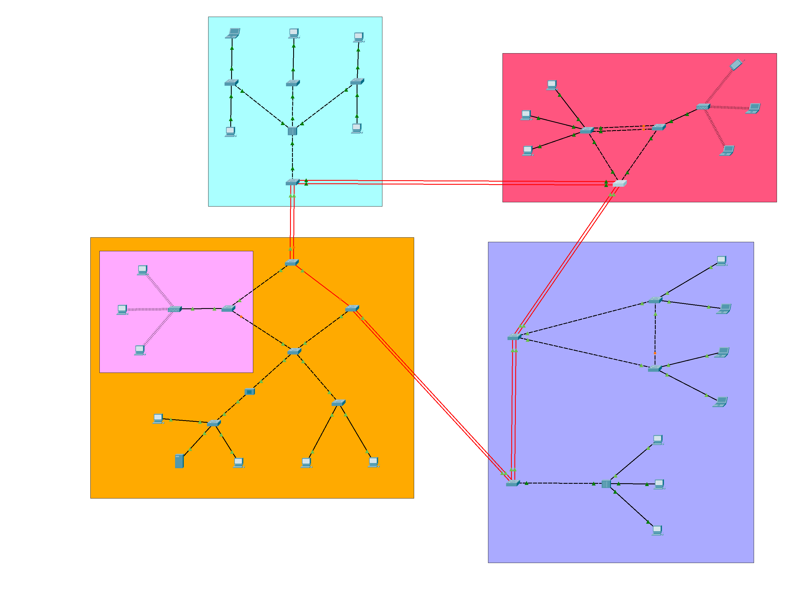
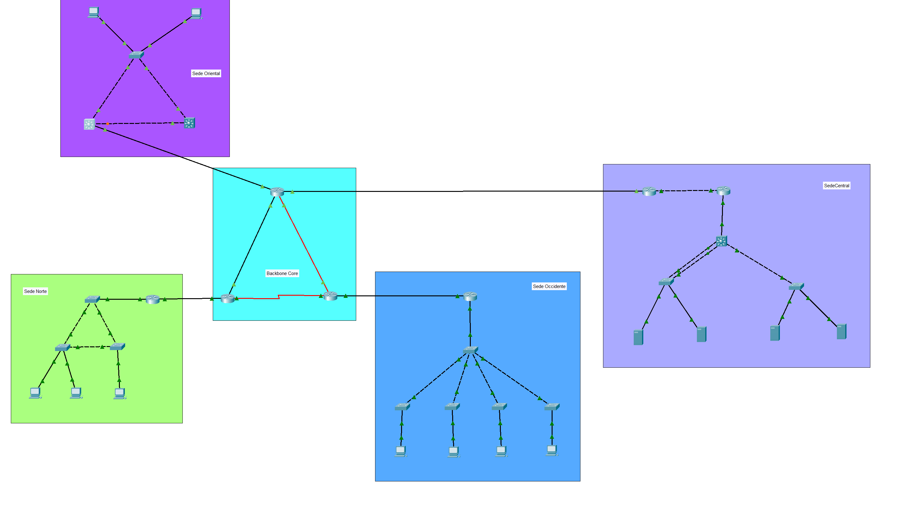
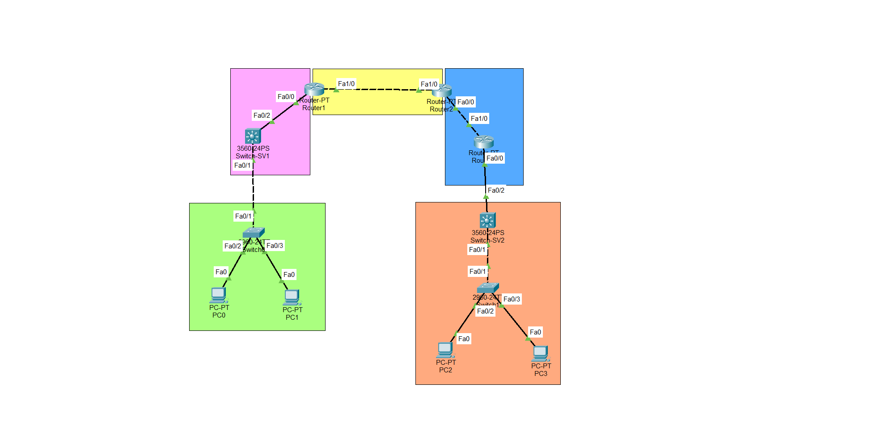

<div align="center">

# Redes de Computadoras 1

**Universidad de San Carlos de Guatemala** · Facultad de Ingeniería · Ingeniería en Sistemas
Primer Semestre de 2026 · Sección A


</div>

| | |
| :-- | :-- |
| **Estudiante** | Hugo Jorge Luis Pérez Arana |
| **Registro académico** | 201504070 |
| **Catedrático** | Ing. Luis Fernando Espino Barrios |
| **Auxiliar (Proyecto 2)** | Josseline Griselda Montecinos Hernández |

---

## Descripción

Este repositorio reúne las prácticas, tareas y proyectos del curso **Redes de Computadoras 1**. Todo el trabajo se desarrolló en **Cisco Packet Tracer** y cada entrega incluye su documentación técnica: topología, tablas de direccionamiento, comandos de configuración, capturas de verificación y pruebas de conectividad.

Los temas avanzan desde la segmentación con VLANs y VTP hasta el enrutamiento dinámico y la alta disponibilidad.

## Contenido del repositorio

| Entrega | Tema | Documentación | Archivo Packet Tracer |
| :-- | :-- | :-- | :-- |
| **Práctica 2** | Red de hospitales de Guatemala | [Readme](Pr%C3%A1ctica2/Readme.md) | [`.pkt`](Pr%C3%A1ctica2/Redes1_1S_2026_201504070.pkt) |
| **Proyecto 1** | NetCore Academy: red de campus de cuatro edificios | [Readme](Proyecto1/Readme.md) | [`.pkt`](Proyecto1/Proyecto1_201504070.pkt) |
| **Proyecto 2** | BanTech GT: infraestructura financiera de alta disponibilidad | [Readme](Proyecto2/Readme.md) | [`.pkt`](Proyecto2/Proyecto2_201504070.pkt) |
| **Tarea 3** | Práctica de VTP y VLANs | [Manual](Tarea3/manual.md) | [`.pkt`](Tarea3/Tarea_3.pkt) |
| **Tarea 4** | Enrutamiento (RIP, OSPF, EIGRP) y VLANs | [Readme](Tarea4/README.md) | [`.pkt`](Tarea4/Tarea4.pkt) |

Los enunciados originales están en PDF dentro de cada carpeta (por ejemplo, [`Proyecto1/[RC1]Enunciado_Proyecto1.pdf`](Proyecto1/%5BRC1%5DEnunciado_Proyecto1.pdf)).

---

## Resumen de cada entrega

### Práctica 2 · Red de hospitales

Interconexión de **seis hospitales reales** del área metropolitana (Roosevelt, San Juan de Dios, IGSS Ginecología y Obstetricia, Salud Mental, Pedro de Bethancourt y Villa Nueva) con una **topología de estrella extendida** alrededor de un switch core.

- Subnetting por área con una VLAN nativa (99).
- VLANs por área funcional y distribución con **VTP**.
- **Rapid PVST+** como protocolo de árbol de expansión.
- **EtherChannel (PAgP)** entre el core y los switches de cada hospital.

<div align="center">
  
</div>

### Proyecto 1 · NetCore Academy

Red de campus con **cuatro edificios (A, B, C y D)**, equipos de acceso, un punto de acceso Wi-Fi y enlaces de fibra entre edificios.

- VLANs, **VTP** (con contraseña aplicada al final), **STP** y **EtherChannel LACP** entre edificios.
- Análisis de **dominios de colisión** por área y **dominios de broadcast** por VLAN.
- Tabla de IPs, tabla de VLANs y pruebas de ping (una exitosa y una fallida por VLAN).
- Capturas de `show spanning-tree`, `show etherchannel summary` y `show interfaces trunk`.
- **Presupuesto estimado** de equipos, cableado y conectores (aprox. 5,810 USD).

La carpeta `Parte práctica` contiene el archivo `practica_proyecto.pkt` de la parte práctica del proyecto.

<div align="center">
  
</div>

### Proyecto 2 · BanTech GT

Red nacional de una entidad financiera con un **Backbone Core** y cuatro sedes: Occidente, Norte, Oriente y Data Center / Sede Central.

- Subnetting **VLSM** por sede y **FLSM /30** para los enlaces punto a punto del backbone.
- Enrutamiento con **OSPF** (dominio principal), **EIGRP** (expansión regional) y rutas estáticas en el área de alta seguridad.
- **Redistribución** entre OSPF, EIGRP y rutas estáticas.
- **HSRP** en Sede Oriente, **Rapid PVST+** en Sede Norte y **Router-on-a-Stick** en Occidente y Norte.
- **VTP** (dominio `bantech70`) y **EtherChannel LACP** en el Data Center.
- Justificación técnica del diseño por sede, pruebas de convergencia, tablas de enrutamiento y pruebas de conmutación por error.

<div align="center">
  
</div>

### Tarea 3 · VTP y VLANs

Cuatro switches 2960 y seis PCs: un switch central **CORE** como servidor VTP (dominio `EMPRESA`, versión 2) y tres switches cliente (**ADMIN**, **MERCA** y **VENTAS**). Se crean las VLANs 10, 20 y 30, se configuran troncales y puertos de acceso, y se comprueba que los pings funcionan dentro de cada VLAN y fallan entre VLANs distintas.

### Tarea 4 · Enrutamiento y VLANs

Tres routers conectados en cadena, cada tramo con un protocolo distinto, y dos redes de acceso con VLANs:

```
RIP  <── Router1 ──> OSPF <── Router2 ──> EIGRP
(Switch-SVI)                              (Router3 / Router on a Stick)
```

- Lado izquierdo (`192.168.70.0/24`): switch capa 3 con **SVIs**.
- Lado derecho (`192.168.71.0/24`): **Router on a Stick** en Router3.
- Redistribución de rutas entre RIP, OSPF y EIGRP, verificación con `show ip route` y una reflexión final sobre la práctica.

<div align="center">
  
</div>

---

## Estructura del repositorio

```
.
├── Práctica2/   Readme.md · .pkt · enunciado PDF · img/
├── Proyecto1/   Readme.md · .pkt · enunciado PDF · Parte práctica/ · img/
├── Proyecto2/   Readme.md · .pkt · enunciado PDF · img/
├── Tarea3/      manual.md · Tarea_3.pkt · img/
├── Tarea4/      README.md · README.pdf · Tarea4.pkt · enunciado PDF · img/
└── LICENSE
```

## Cómo abrir las simulaciones

1. Instalar [Cisco Packet Tracer](https://www.netacad.com/cisco-packet-tracer).
2. Clonar el repositorio:
   ```bash
   git clone https://github.com/hugoarana89/Redes1_1S_2026_201504070.git
   ```
3. Abrir el archivo `.pkt` de la entrega que se quiera revisar. Cada archivo corresponde a la documentación de su misma carpeta.

## Herramientas y protocolos

- **Herramienta:** Cisco Packet Tracer.
- **Capa 2:** VLANs, trunking 802.1Q, VTP, STP / Rapid PVST+, EtherChannel (LACP y PAgP).
- **Capa 3:** subnetting VLSM y FLSM, SVIs, Router-on-a-Stick, RIP, OSPF, EIGRP, redistribución de rutas, rutas estáticas y HSRP.

## Licencia

Distribuido bajo la licencia incluida en el archivo [LICENSE](LICENSE).
