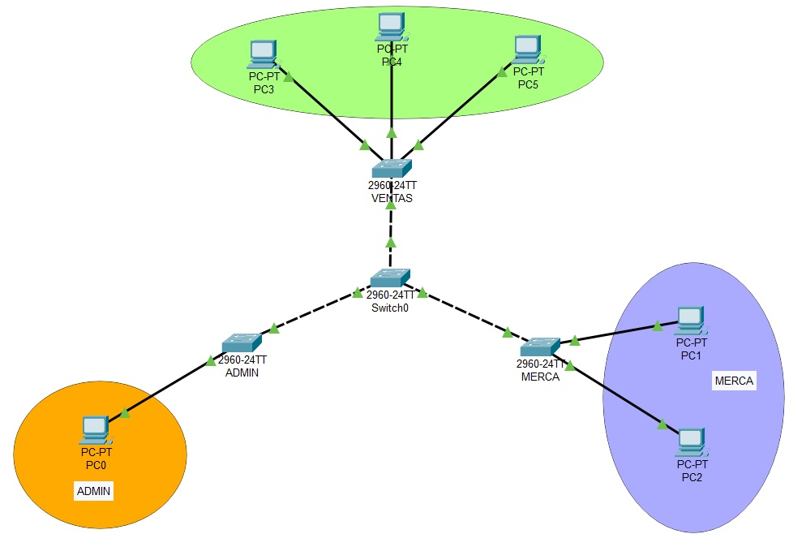
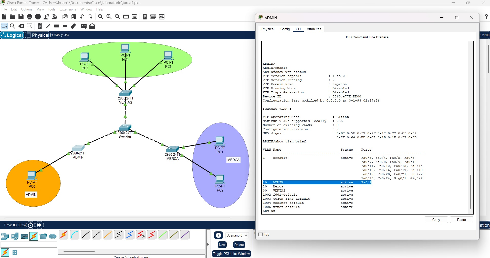
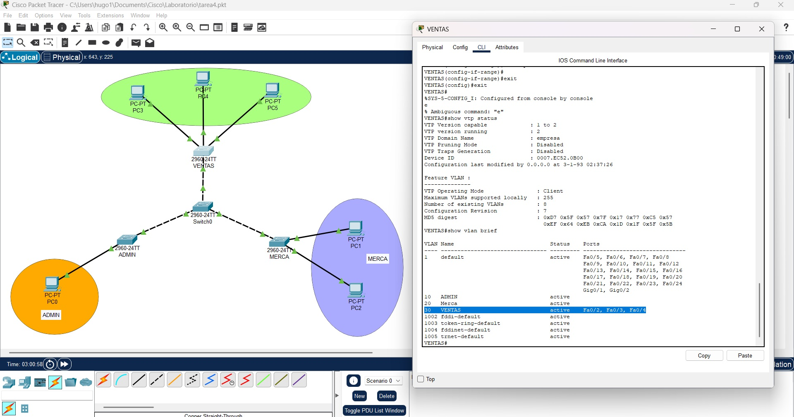
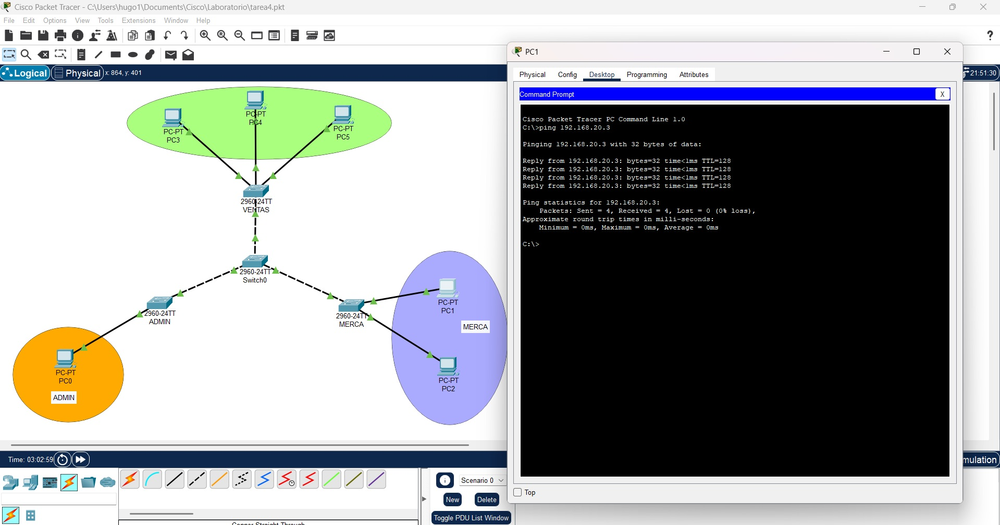
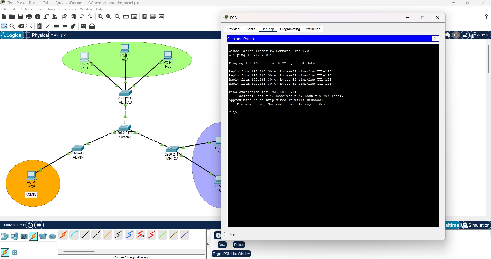
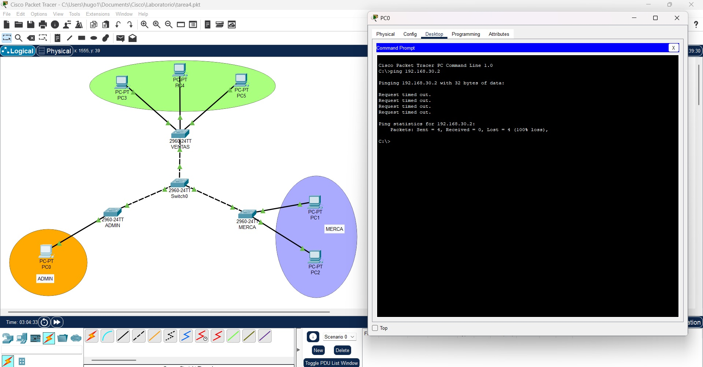
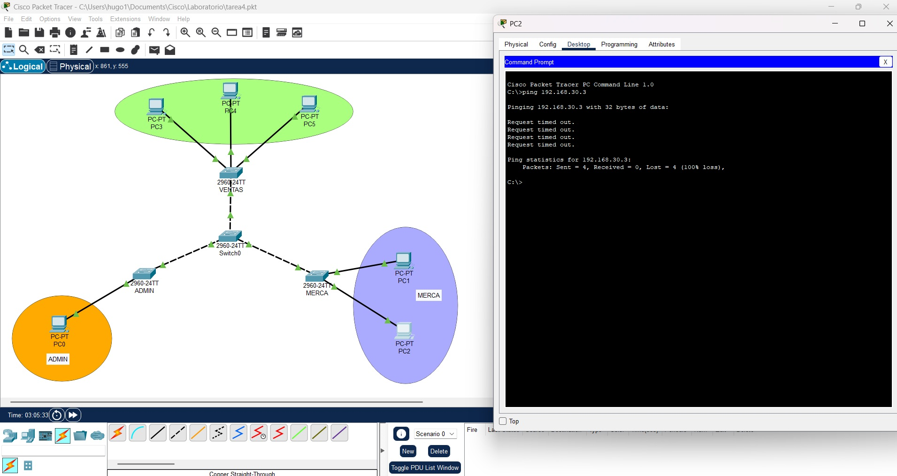

# Práctica VTP y VLANs

## Topología
<div align="center">
  
  <p><i>Figura 1: Red en Cisco Packet Tracer con cuatro switches (2960) y seis PCs.</i></p>
</div>

---

## Configuraciones

### 1. Configuración del switch central (VTP Server)

```bash
enable
configure terminal

hostname CORE
vtp mode server
vtp domain EMPRESA
vtp password cisco
vtp version 2
```

Crear las VLANs (solo en el servidor):

```bash
vlan 10
name ADMIN

vlan 20
name MERCA

vlan 30
name VENTAS
```

Configurar enlaces troncales hacia los otros switches, Se usó  FastEthernet0/1, 0/2, 0/3:

```bash
interface range fa0/1 - 3
switchport mode trunk
```

Salir:

```bash
exit
```

---

### Configuración Switch ADMIN (VTP Client)

```bash
enable
configure terminal

hostname ADMIN
vtp mode client
vtp domain EMPRESA
vtp password cisco
vtp version 2
```

Configurar puerto hacia CORE como trunk:

```bash
interface fa0/1
switchport mode trunk
```

Asignar PC0 a VLAN ADMIN:

```bash
interface fa0/2
switchport mode access
switchport access vlan 10
```

---

### Configuración Switch MERCA

```bash
enable
configure terminal

hostname MERCA
vtp mode client
vtp domain EMPRESA
vtp password cisco
vtp version 2
```

Troncal:

```bash
interface fa0/1
switchport mode trunk
```

PC1 y PC2 en VLAN 20:

```bash
interface range fa0/2 - 3
switchport mode access
switchport access vlan 20
```

---

### Configuración Switch VENTAS

```bash
enable
configure terminal

hostname VENTAS
vtp mode client
vtp domain EMPRESA
vtp password cisco
vtp version 2
```

Troncal:

```bash
interface fa0/1
switchport mode trunk
```

PC3, PC4, PC5 en VLAN 30:

```bash
interface range fa0/2 - 4
switchport mode access
switchport access vlan 30
```

---

### Configuración IP de las PCs

Como no se usó router no se configura gateway.

#### VLAN 10 – ADMIN

* PC0 → 192.168.10.2 / 255.255.255.0

#### VLAN 20 – MERCA

* PC1 → 192.168.20.2 / 255.255.255.0
* PC2 → 192.168.20.3 / 255.255.255.0

#### VLAN 30 – VENTAS

* PC3 → 192.168.30.2 / 255.255.255.0
* PC4 → 192.168.30.3 / 255.255.255.0
* PC5 → 192.168.30.4 / 255.255.255.0

---

## Capturas de comandos (show vtp status, show vlan brief)

### ADMIN (show vtp status, show vlan brief):

<div align="center">
  
  <p><i>Figura 2: comandos (show vtp status, show vlan brief) pra el switch ADMIN.</i></p>
</div>

### MERCA (show vtp status, show vlan brief):

<div align="center">
  
  <p><i>Figura 2: comandos (show vtp status, show vlan brief) pra el switch MERCA.</i></p>
</div>

### VENTAS (show vtp status, show vlan brief):

<div align="center">
  
  <p><i>Figura 3: comandos (show vtp status, show vlan brief) pra el switch VENTAS.</i></p>
</div>

---

## Resultados de ping

### Ping de PC1 a PC2

El resulatado es positivo ya que ambas pc se encuentran en la VLAN Merca.

<div align="center">
  
  <p><i>Figura 4: Pin que muestra la conección positiva entre pc0 y pc1.</i></p>
</div>

### Ping de PC3 a PC5

El resulatado es positivo ya que ambas pc se encuetran en la VLAN ventas.

<div align="center">
  
  <p><i>Figura 5: Pin que muestra la conección positiva entre pc3 y pc5.</i></p>
</div>

### Ping de PC0 a PC3

El resulatado es negativo ya que la PC0 se encuetran en la VLAN ADMIN Y PC3 se encuentran en la VLAN ventas.

<div align="center">
  
  <p><i>Figura 6: Pin que muestra la conección fallida entre PC0 y PC3.</i></p>
</div>


### Ping de PC2 a PC4

El resulatado es negativo ya que la PC2 se encuetran en LA vlan MERCA Y PC4 se encuentran en la VLAN ventas.

<div align="center">
  
  <p><i>Figura 7: Pin que muestra la conección fallida entre PC2 y PC4.</i></p>
</div>

---