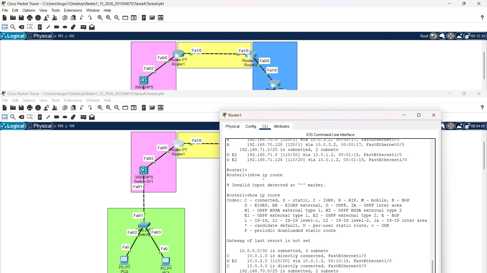
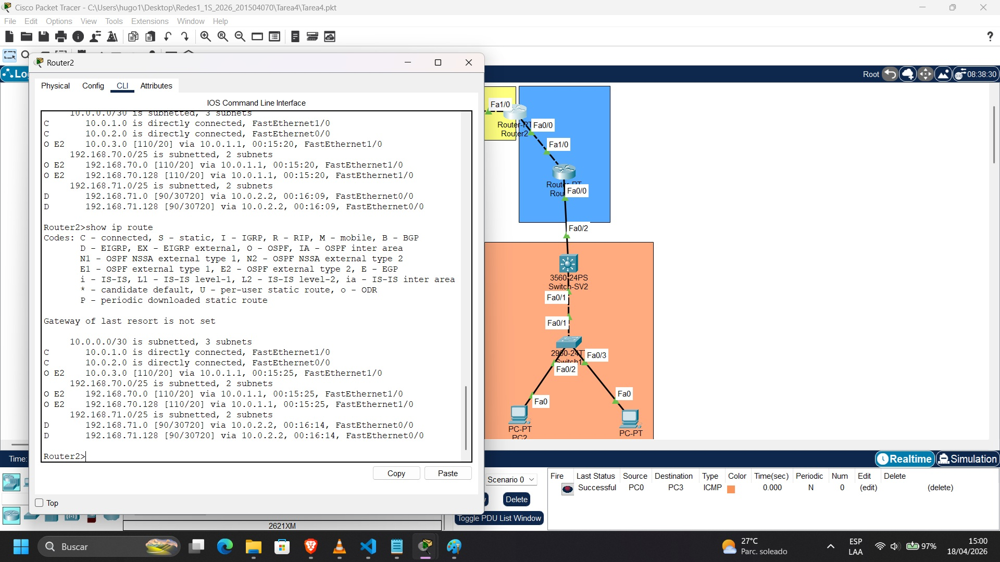
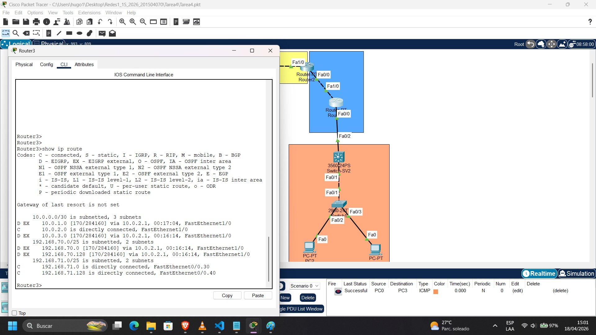
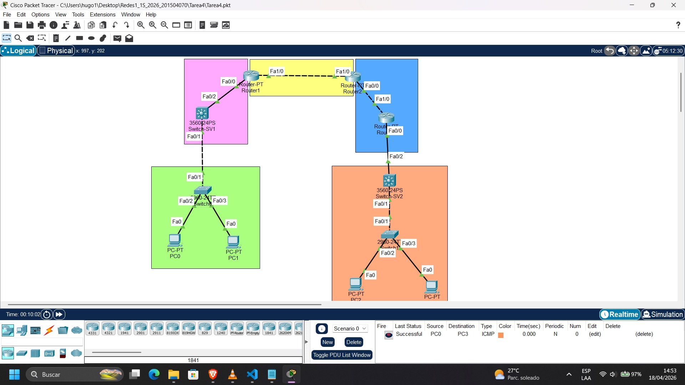

**UNIVERSIDAD DE SAN CARLOS DE GUATEMALA**   
**FACULTAD DE INGENIERÍA**  
**INGENIERÍA EN SISTEMAS**  
**REDES DE COMPUTADORAS 1**  
**PRIMER SEMESTRE DE 2026**

| Registro académico: 201504070  | CUI: 3236666040511 |
| :---- | :---- |
| **Nombre:** Hugo Jorge Luis Perez Arana | **Tarea:** 4 |
| **Ing.** Luis Fernando Espino Barrios | **Sección:** A |

# Configuración de Red – Proyecto de Enrutamiento y VLANs

## Topología

<div align="center">
  
</div>

## Conexiones

| # | Dispositivo 1 | Dispositivo 2 | Dispositivos en el dominio |
|---|---------------|---------------|----------------------------|
| 1 | Router PT | Router PT | Router1 Fa1/0 ↔ Router2 F1/0 |
| 2 | Router PT | 3560-24PS | Router1 Fa0/0 ↔ Switch-SV1 F0/2 |
| 3 | 3560-24PS | 2960-24T | Switch-SV1 Fa0/1 ↔ Switch0 Fa0/1 |
| 4 | 2960-24T | PC | Switch0 Fa0/2 ↔ PC0 Fa0 |
| 5 | 2960-24T | PC | Switch0 Fa0/3 ↔ PC1 Fa0 |
| 6 | Router PT | Router PT | Router2 Fa0/0 ↔ Router3 Fa1/0 |
| 7 | Router PT | 3560-24PS | Router3 Fa0/0 ↔ Switch-SV2 Fa0/2 |
| 8 | 3560-24PS | 2960-24T | Switch-SV2 Fa0/1 ↔ Switch1 Fa0/1 |
| 9 | 2960-24T | PC | Switch1 Fa0/2 ↔ PC2 Fa0 |
| 10 | 2960-24T | PC | Switch1 Fa0/3 ↔ PC3 Fa0 |

---

## 1. Definición de Parámetros

El número de carné es **201504070**, por lo tanto **XX = 70** (últimos dos dígitos significativos).

### 1.1 Segmentos de Red

| Área | Red | Máscara | Descripción |
|------|-----|---------|-------------|
| Verde | 192.168.70.0 | /24 | Lado Izquierdo (SVI) |
| Naranja | 192.168.71.0 | /24 | Lado Derecho (Router on a Stick) |
| Enlace Serial 1 | 10.0.1.0 | /30 | Router1 ↔ Router2 (OSPF) |
| Enlace Serial 2 | 10.0.2.0 | /30 | Router2 ↔ Router3 (EIGRP) |
| Enlace Serial 3 | 10.0.3.0 | /30 | Router1 ↔ Switch-SVI (RIP) |

### 1.2 VLANs y Subredes

La red /24 de cada área se subdivide en dos /25 para alojar dos VLANs.

| VLAN | Nombre | Red | Gateway | Área |
|------|--------|-----|---------|------|
| 10 | VLAN10-Verde | 192.168.70.0/25 | 192.168.70.1 | Verde (SVI) |
| 20 | VLAN20-Verde | 192.168.70.128/25 | 192.168.70.129 | Verde (SVI) |
| 30 | VLAN30-Naranja | 192.168.71.0/25 | 192.168.71.1 | Naranja (RoaS) |
| 40 | VLAN40-Naranja | 192.168.71.128/25 | 192.168.71.129 | Naranja (RoaS) |

### 1.3 Asignación de IPs a Interfaces de Enrutadores

| Dispositivo | Interfaz | Dirección IP | Máscara | Protocolo |
|-------------|----------|-------------|---------|-----------|
| Router1 | Fa0/0 | 10.0.3.1 | /30 | RIP |
| Router1 | Fa1/0 | 10.0.1.1 | /30 | OSPF |
| Router2 | Fa1/0 | 10.0.1.2 | /30 | OSPF |
| Router2 | Fa0/0 | 10.0.2.1 | /30 | EIGRP |
| Router3 | Fa1/0 | 10.0.2.2 | /30 | EIGRP |
| Router3 | Fa0/0.30 | 192.168.71.1 | /25 | RoaS VLAN 30 |
| Router3 | Fa0/0.40 | 192.168.71.129 | /25 | RoaS VLAN 40 |
| Switch-SVI | Fa0/2 | 10.0.3.2 | /30 | RIP (routed port) |
| Switch-SVI | VLAN 10 | 192.168.70.1 | /25 | SVI |
| Switch-SVI | VLAN 20 | 192.168.70.129 | /25 | SVI |

### 1.4 Asignación de IPs a PCs

| PC | VLAN | Dirección IP | Máscara | Gateway |
|----|------|-------------|---------|---------|
| PC0 | 10 | 192.168.70.10 | 255.255.255.128 | 192.168.70.1 |
| PC1 | 20 | 192.168.70.130 | 255.255.255.128 | 192.168.70.129 |
| PC2 | 30 | 192.168.71.10 | 255.255.255.128 | 192.168.71.1 |
| PC3 | 40 | 192.168.71.130 | 255.255.255.128 | 192.168.71.129 |

---

## 2. Configuración de Dispositivos

### 2.1 Router1

Router1 actúa como punto de redistribución entre RIP (hacia Switch-SVI) y OSPF (hacia Router2).

```sh
enable
configure terminal
hostname Router1
!
! --- Interfaz hacia Switch-SVI (RIP) ---
interface FastEthernet0/0
ip address 10.0.3.1 255.255.255.252
no shutdown
!
! --- Interfaz hacia Router2 (OSPF) ---
interface FastEthernet1/0
ip address 10.0.1.1 255.255.255.252
no shutdown
!
! --- Protocolo RIP ---
router rip
version 2
no auto-summary
network 10.0.3.0
redistribute ospf 1 metric 5
!
! --- Protocolo OSPF ---
router ospf 1
network 10.0.1.0 0.0.0.3 area 0
redistribute rip subnets
!
end
write memory
exit
```

> **Nota:** La redistribución en Router1 convierte las rutas aprendidas por OSPF en rutas RIP (con métrica de 5 saltos) y las rutas RIP en rutas OSPF (con métrica de costo 100).

---

### 2.2 Router2

Router2 actúa como punto de redistribución entre OSPF (hacia Router1) y EIGRP (hacia Router3).

```sh
enable
configure terminal
hostname Router2
!
! --- Interfaz hacia Router1 (OSPF) ---
interface FastEthernet1/0
ip address 10.0.1.2 255.255.255.252
no shutdown
!
! --- Interfaz hacia Router3 (EIGRP) ---
interface FastEthernet0/0
ip address 10.0.2.1 255.255.255.252
no shutdown
!
! --- Protocolo OSPF ---
router ospf 1
network 10.0.1.0 0.0.0.3 area 0
redistribute rip subnets
#redistribute eigrp 100 subnets metric 100
!
! --- Protocolo EIGRP ---
router eigrp 100
no auto-summary
network 10.0.2.0 0.0.0.3
redistribute ospf 1 metric 10000 100 255 1 1500
!
enable
configure terminal
router ospf 1
redistribute eigrp 100 subnets
!
end
write memory
```

> **Nota:** La redistribución de EIGRP a OSPF requiere la palabra clave `subnets`. La redistribución de OSPF a EIGRP requiere los cinco parámetros de métrica compuesta (ancho de banda, retardo, confiabilidad, carga, MTU).

---

### 2.3 Router3 — Router on a Stick

Router3 utiliza subinterfaces encapsuladas en 802.1Q sobre FastEthernet0/0 para servir como gateway de las dos VLANs del área naranja.

```sh
enable
configure terminal
hostname Router3
!
! --- Interfaz hacia Router2 (EIGRP) ---
interface FastEthernet1/0
ip address 10.0.2.2 255.255.255.252
no shutdown
!
! --- Interfaz física hacia Switch-SV2 (sin IP, solo activa) ---
interface FastEthernet0/0
no ip address
no shutdown
!
! --- Subinterfaz VLAN 30 ---
interface FastEthernet0/0.30
encapsulation dot1Q 30
ip address 192.168.71.1 255.255.255.128
!
! --- Subinterfaz VLAN 40 ---
interface FastEthernet0/0.40
encapsulation dot1Q 40
ip address 192.168.71.129 255.255.255.128
!
! --- Protocolo EIGRP ---
router eigrp 100
no auto-summary
network 10.0.2.0 0.0.0.3
network 192.168.71.0 0.0.0.127
network 192.168.71.128 0.0.0.127
!
end
write memory
```

---

### 2.4 Switch-SVI (Cisco 3560) — Lado Izquierdo

El Switch-SVI implementa enrutamiento entre VLANs mediante interfaces virtuales SVI. El puerto Fa0/2 se convierte en un puerto enrutado (Layer 3) para comunicarse con Router1 mediante RIP.

```sh
enable
configure terminal
hostname Switch-SVI
!
! --- Habilitar enrutamiento IP en el switch ---

ip routing
!
! --- Creación de VLANs ---
vlan 10
name VLAN10-Verde
!
vlan 20
name VLAN20-Verde
!
! --- Puerto enrutado hacia Router1 (RIP) ---
interface FastEthernet0/2
no switchport
ip address 10.0.3.2 255.255.255.252
no shutdown
!
! --- Puerto trunk hacia Switch0 ---
interface FastEthernet0/1
switchport trunk encapsulation dot1q
switchport mode trunk
no shutdown
!
! --- SVI VLAN 10 (gateway área verde, subred .0/25) ---
interface Vlan10
ip address 192.168.70.1 255.255.255.128
no shutdown
!
! --- SVI VLAN 20 (gateway área verde, subred .128/25) ---
interface Vlan20
ip address 192.168.70.129 255.255.255.128
no shutdown
!
! --- Protocolo RIP ---
router rip
version 2
no auto-summary
network 10.0.3.0
network 192.168.70.0
!
end
write memory
```

---

### 2.5 Switch-SV2 (Cisco 3560) — Lado Derecho

El Switch-SV2 del lado naranja actúa como switch de distribución, pasando el trunk de VLANs entre Router3 y Switch1. No requiere enrutamiento habilitado.

```sh
enable
configure terminal
hostname Switch-SV2
!
! --- Creación de VLANs ---
vlan 30
name VLAN30-Naranja
!
vlan 40
name VLAN40-Naranja
!
! --- Puerto trunk hacia Router3 ---
interface FastEthernet0/2
switchport trunk encapsulation dot1q
switchport mode trunk
no shutdown
!
! --- Puerto trunk hacia Switch1 ---
interface FastEthernet0/1
switchport trunk encapsulation dot1q
switchport mode trunk
no shutdown
!
end
write memory
```

---

### 2.6 Switch0 (Cisco 2960) — Lado Izquierdo

Switch0 es el switch de acceso del área verde. Asigna PC0 a VLAN 10 y PC1 a VLAN 20.

```sh
enable
configure terminal
hostname Switch0
!
! --- Creación de VLANs ---
vlan 10
name VLAN10-Verde
!
vlan 20
name VLAN20-Verde
!
! --- Puerto trunk hacia Switch-SVI ---
interface FastEthernet0/1
switchport mode trunk
no shutdown
!
! --- Puerto de acceso para PC0 (VLAN 10) ---
interface FastEthernet0/2
switchport mode access
switchport access vlan 10
no shutdown
!
! --- Puerto de acceso para PC1 (VLAN 20) ---
interface FastEthernet0/3
switchport mode access
switchport access vlan 20
no shutdown
!
end
write memory
```

---

### 2.7 Switch1 (Cisco 2960) — Lado Derecho

Switch1 es el switch de acceso del área naranja. Asigna PC2 a VLAN 30 y PC3 a VLAN 40.

```sh
enable
configure terminal
hostname Switch1
!
! --- Creación de VLANs ---
vlan 30
name VLAN30-Naranja
!
vlan 40
name VLAN40-Naranja
!
! --- Puerto trunk hacia Switch-SV2 ---
interface FastEthernet0/1
switchport mode trunk
no shutdown
!
! --- Puerto de acceso para PC2 (VLAN 30) ---
interface FastEthernet0/2
switchport mode access
switchport access vlan 30
no shutdown
!
! --- Puerto de acceso para PC3 (VLAN 40) ---
interface FastEthernet0/3
switchport mode access
switchport access vlan 40
no shutdown
!
end
write memory
```

---

### 2.8 Configuración de PCs

La configuración de cada PC se realiza de forma estática en Packet Tracer desde la pestaña **Desktop > IP Configuration**.

| PC | IP Address | Subnet Mask | Default Gateway |
|----|-----------|-------------|-----------------|
| PC0 | 192.168.70.10 | 255.255.255.128 | 192.168.70.1 |
| PC1 | 192.168.70.130 | 255.255.255.128 | 192.168.70.129 |
| PC2 | 192.168.71.10 | 255.255.255.128 | 192.168.71.1 |
| PC3 | 192.168.71.130 | 255.255.255.128 | 192.168.71.129 |

---

## 3. Resumen de Redistribución de Rutas

La redistribución es necesaria porque cada protocolo mantiene su propia tabla de enrutamiento y no comparte rutas con otros protocolos de forma nativa.

```
RIP  <──── Router1 ────> OSPF <──── Router2 ────> EIGRP
(Switch-SVI)                              (Router3 / Área Naranja)
```

| Punto de Redistribución | Dirección | Comando utilizado |
|------------------------|-----------|-------------------|
| Router1 | OSPF → RIP | `redistribute ospf 1 metric 5` |
| Router1 | RIP → OSPF | `redistribute rip subnets metric 100` |
| Router2 | EIGRP → OSPF | `redistribute eigrp 100 subnets metric 100` |
| Router2 | OSPF → EIGRP | `redistribute ospf 1 metric 10000 100 255 1 1500` |

---

## 4. Verificación

Se recomienda ejecutar los siguientes comandos para confirmar la correcta operación de la red.

```bash
# Verificar tablas de enrutamiento
show ip route

# Verificar vecinos RIP
show ip rip database

# Verificar vecinos OSPF
show ip ospf neighbor

# Verificar vecinos EIGRP
show ip eigrp neighbors

# Verificar VLANs en switches
show vlan brief

# Verificar interfaces trunk
show interfaces trunk

# Prueba de conectividad extremo a extremo
ping 192.168.71.10   ! desde PC0 hacia PC2
```

## show ip route en cada router

### Router 1

<div align="center">
  
</div>

### Router 2

<div align="center">
  
</div>

### Router 3

<div align="center">
  
</div>

## Prueba de ping

<div align="center">
  
</div>

## 🧠 Reflexión sobre la Práctica de Enrutamiento y VLANs

### a. Reflexión

En esta tarea se logró comprender de manera práctica la integración de múltiples protocolos de enrutamiento dentro de una misma red, específicamente RIP, OSPF y EIGRP, así como la importancia de la redistribución de rutas para garantizar la conectividad total entre diferentes dominios de enrutamiento.

También se reforzaron conceptos clave como:
- Segmentación de red mediante direccionamiento IP.
- Implementación de VLANs para separar dominios de broadcast.
- Configuración de Inter-VLAN Routing utilizando SVI y Router on a Stick.

Durante la configuración, los errores más comunes estuvieron relacionados con:
- Direccionamiento incorrecto en interfaces.
- Falta de activación (`no shutdown`) en interfaces.
- Omisión de redes en los protocolos de enrutamiento.
- Problemas en la redistribución de rutas entre protocolos.

Estos errores fueron enfrentados mediante:
- Verificación constante con comandos como `show ip route` y `show ip protocols`.
- Pruebas de conectividad con `ping`.
- Revisión detallada de la configuración en cada dispositivo.

Este proceso permitió desarrollar habilidades de diagnóstico y solución de problemas en redes.

---

### b. Aplicación práctica

El conocimiento adquirido sobre enrutamiento multi-protocolo es altamente aplicable en entornos reales, donde es común encontrar infraestructuras que utilizan diferentes protocolos de enrutamiento debido a crecimiento progresivo o integración de tecnologías.

En la vida profesional, este conocimiento permitirá:
- Integrar redes heredadas con nuevas implementaciones.
- Diseñar soluciones escalables utilizando protocolos adecuados según el contexto.
- Implementar redistribución de rutas de forma controlada para evitar problemas como loops o rutas inconsistentes.
- Diagnosticar fallos en redes complejas con múltiples protocolos activos.

Además, el manejo de VLANs e interconexión entre ellas es fundamental en redes empresariales para mejorar la seguridad y organización del tráfico.

---

### c. Conclusión

La práctica permitió consolidar conocimientos fundamentales de redes avanzadas, destacando la importancia del diseño estructurado, la correcta configuración de protocolos de enrutamiento y la interoperabilidad entre ellos mediante redistribución.

Se evidenció que una red funcional no depende únicamente de la configuración individual de dispositivos, sino de la correcta integración de todos los componentes. Asimismo, se fortalecieron habilidades prácticas en configuración, verificación y resolución de problemas, las cuales son esenciales en el ámbito profesional de redes.

En síntesis, la experiencia contribuyó al desarrollo de una visión más integral del funcionamiento de redes empresariales, preparando al estudiante para enfrentar escenarios reales con mayor seguridad y criterio técnico.